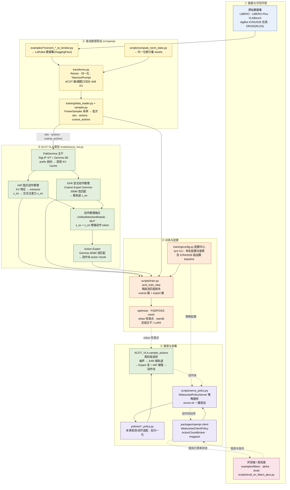
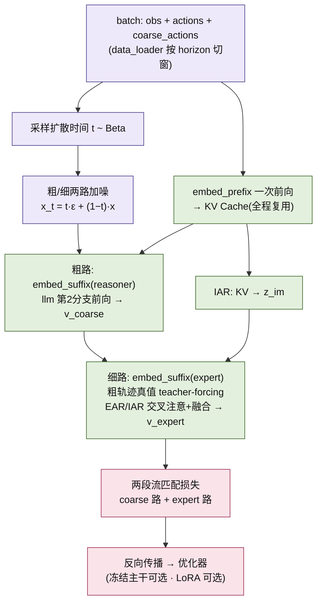
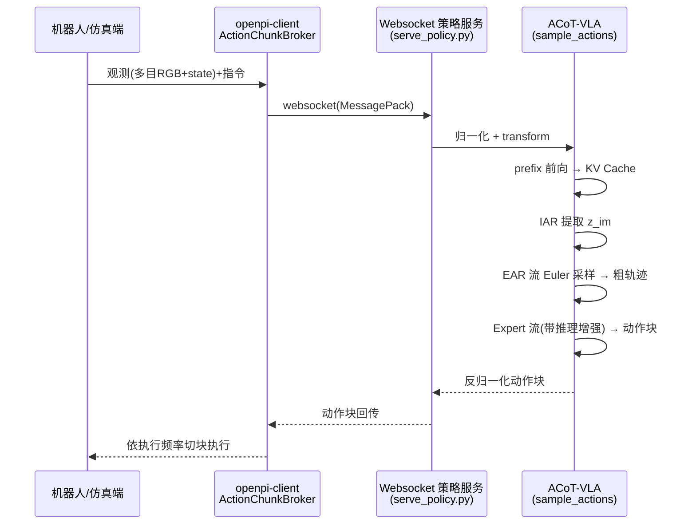

# 架构总览 Architecture

> 核验于源码基线 commit cb9d195 · 所有代码引用均可溯源。

本页是全站的“地图页”：把仓库按「① 数据与评测环境 → ② 离线数据管线 → ③ ACoT-VLA 模型 → ④ 训练与配置 → ⑤ 推理与部署」五层切开，先给出一张主架构图作为全局心智模型，再用分层导读与模块地图回答每一层“做什么、入口文件在哪、与相邻层如何衔接”。数据从原始演示出发、经离线管线进入模型；训练与推理分居模型两侧各成闭环，中间仅靠 orbax 检查点与命名配置解耦。各层的机制级细节由对应深潜页展开（见文末对照表）。

## 主架构图

ACoT-VLA 全系统五层架构：数据 → 管线 → 模型 → 训练/推理 双侧闭环，中间通过 orbax 检查点解耦。

主数据流自下而上：原始数据集与评测端（①）经转换脚本进入离线管线（②），归一化、双窗切分后由 DataLoader 产出 obs·actions·coarse_actions 批次送入模型主干（③）；训练期（④）把 IAR/EAR/Action Expert 三路输出与数据批次汇成两段流匹配损失，经优化器、mesh 分片写入 orbax 检查点；部署期（⑤）读取检查点权重与策略配置，经 sample_actions、策略服务、openpi-client 把动作块送回评测端/真机端执行。两条虚线（R2⇢S1、R3⇢S3）表示训练与部署只在“权重 + 配置”两个界面上耦合，可以不同机器、不同时刻独立进行。

## 分层导读

### ① 数据与评测环境

对应主图 D1 与 E1 节点，本层提供“原料”与“考官”。原始数据覆盖 LIBERO / LIBERO-Plus / VLABench / AgiBot ICRA2026 仿真 / DROID（RLDS）等基准，并含 ALOHA、go1/go2、AgileX 等真机数据。评测端由 `examples/libero/main.py:54` 与 `scripts/eval_on_libero_plus.py:50` 的 eval_libero 驱动仿真 rollout，真机端入口在 examples/aloha_real 等；评测观测经 ⑤ 的 WebSocket 客户端上行（E1⇢S4），拿回动作块后按执行频率逐帧下发。评测/真机端在喂给模型前会按 shift 抽帧组织粗/细动作窗口，见 `src/openpi/policies/libero_policy.py:103` 的 LiberoACOTInputs。

### ② 离线数据管线

对应主图 T1–T4，把原始演示变成模型可吃的“三元组”。多源数据由三个转换脚本统一导出为 LeRobot（HuggingFace）数据集：`examples/libero/convert_libero_data_to_lerobot.py`、`examples/aloha_real/convert_aloha_data_to_lerobot.py` 与 `examples/droid/convert_droid_data_to_lerobot.py`；`scripts/compute_norm_stats.py:89` 对 state / actions / coarse_actions 统计 RunningStats 并生成归一化资产。`src/openpi/transforms.py:258` 起的一系列变换（ACOTDeltaActions / ACOTAbsoluteActions / TokenizePrompt / ACOTPadStatesAndActions 等）负责动作空间转换与 token 化；训练与评测共用的“粗/细双窗 + shift 抽帧”在数据配置中以 `joint_action_shifts=(2, 1)` 预设（`src/openpi/training/config.py:454`）。最终由 `src/openpi/training/data_loader.py:599` 的 DataLoaderACOTImpl 与 `src/openpi/training/sampler.py:66` 的 FrameSampler 产出批次：粗窗口 coarse_actions 供 EAR 推理，细窗口 actions 供 Action Expert 去噪。

### ③ 模型核心

对应主图 M1–M5，即 `src/openpi/models/acot_vla.py:376` 的 ACOT_VLA。图像先由 `src/openpi/models/siglip.py` 的 SigLIP So400m/14 ViT 编码为视觉 token，与指令 token 一起在 `src/openpi/models/gemma.py:387` 的 Gemma 主干上做 prefix 双向前向（embed_prefix，`src/openpi/models/acot_vla.py:516`），得到全程复用的逐层 KV Cache。其后两条“推理支路”并行生长：EAR 由 Coarse Expert（Gemma-300M 流匹配）输出长时域粗轨迹 z_ex；IAR 从 KV 特征抽取 z_im 再经交叉注意力得 s_im；二者与加噪动作 token 在 embed_suffix 双分支（`src/openpi/models/acot_vla.py:551`）中经 UnifiedAttentionModule / MLP 融合后，送入 Action Expert 解出精细动作块。主干与两个 300M 专家共享同一份“多 expert 混合权重”的同深度 Gemma 扫掠。

### ④ 训练与配置

训练侧对应主图 R1–R2：`scripts/train.py:194` 的 acot_train_step 每步把三元组批次送入 `src/openpi/models/acot_vla.py:695` 的 compute_loss，算“coarse 速度场 + expert 速度场”两段流匹配损失；参数更新由 `src/openpi/training/optimizer.py`（AdamW + 余弦退火）、`src/openpi/training/sharding.py`（FSDP/OSS mesh）与 `src/openpi/training/checkpoints.py`（orbax 检查点）完成；`src/openpi/training/weight_loaders.py:57` 的 ACOTCheckpointWeightLoader 把 pi0/pi0-5 的 action_* 投影重映射到 coarse_action_*，为 EAR 提供稳定的预训练初始化。配置侧对应主图 R3：`src/openpi/training/config.py` 注册了 25 个命名配置（其中 8 个 ACoT，含 ICRA2026 挑战赛 baseline），经 cli / get_config（`src/openpi/training/config.py:1947`、`:1951`）由 tyro CLI 装配；完整注册表见 /generated/config-registry。

### ⑤ 推理与部署

对应主图 S1–S4。推理自检查点恢复权重后调用 `src/openpi/models/acot_vla.py:795` 的 sample_actions：先做 EAR 粗路的流匹配 Euler 采样得到粗轨迹，再以粗轨迹与 IAR 增强为条件执行 Action Expert 流，输出动作块。`src/openpi/policies/` 下的 libero、vlabench、aloha、droid 等策略适配器完成本体观测/动作与模型格式互转（含反归一化）；`src/openpi/serving/websocket_policy_server.py:15` 的 WebsocketPolicyServer 由 `scripts/serve_policy.py:94` 装配策略并对外服务（scripts/server.sh 一键启动）；远端客户端位于 packages/openpi-client，其中 WebsocketClientPolicy（`packages/openpi-client/src/openpi_client/websocket_client_policy.py:12`，MessagePack 协议）负责通信，ActionChunkBroker（`packages/openpi-client/src/openpi_client/action_chunk_broker.py:10`）负责按执行频率逐帧吐块。

## 模块地图

下表按五层列出核心模块的真实路径、职责与关键符号（自动生成索引见 [/generated/module-map](/generated/module-map)）：

| 模块（真实路径） | 职责 | 关键符号 |
|---|---|---|
| `src/openpi/models/acot_vla.py` | ACoT 模型本体：EAR/IAR 双推理支路、专家融合、训练损失与两阶段采样 | `ACOT_VLA` · `ACOTConfig` · `compute_loss` · `sample_actions` |
| `src/openpi/models/gemma.py` | Gemma LLM 主干：同深度“多 expert 混合权重”承载 2B 主干与 300M 双专家 | `Module` |
| `src/openpi/models/siglip.py` | SigLIP So400m/14 ViT：图像 → 视觉 token | `Module` · `Encoder` |
| `src/openpi/transforms.py` | 数据/模型变换：动作空间、token 化、双窗口 padding | `ACOTDeltaActions` · `TokenizePrompt` · `ACOTPadStatesAndActions` |
| `src/openpi/training/data_loader.py` | 训练数据加载：产出 obs / actions / coarse_actions 三元组 | `DataLoaderACOTImpl` |
| `src/openpi/training/sampler.py` | 按任务/子任务区间采样帧 | `FrameSampler` |
| `src/openpi/training/config.py` | 配置中心：25 个命名配置（ACOT×8）与 tyro CLI | `TrainConfig` · `cli` · `get_config` |
| `src/openpi/training/optimizer.py` | AdamW 优化器与学习率调度 | `AdamW` · `CosineDecaySchedule` |
| `src/openpi/training/sharding.py` | FSDP/OSS mesh 并行分片 | `make_mesh` · `fsdp_sharding` |
| `src/openpi/training/checkpoints.py` | orbax 检查点保存 / 恢复 | `save_state` · `restore_state` |
| `src/openpi/training/weight_loaders.py` | 预训练权重映射：pi0/pi0-5 → ACoT（EAR 初始化） | `ACOTCheckpointWeightLoader` · `PaliGemmaWeightLoader` |
| `src/openpi/policies/`（libero / vlabench / aloha / droid / go1 等） | 本体观测/动作 ↔ 模型输入输出适配（含评测端双窗抽帧） | `LiberoACOTInputs` · `VLABenchACOTInputs` |
| `src/openpi/serving/websocket_policy_server.py` + `scripts/serve_policy.py` | WebSocket 策略服务与启动入口 | `WebsocketPolicyServer` · `create_policy` |
| `packages/openpi-client/src/openpi_client/` | 客户端策略通信与逐帧动作分发 | `WebsocketClientPolicy` · `ActionChunkBroker` |

## 训练与推理闭环

训练与推理共用同一模型实现，差异只在前向的组织方式：训练走“两步前向 + 两段流匹配损失”，推理走“两阶段 Euler 采样”。两张局部图分别放大主图 G4 与 G5 的内部时序。

### 训练闭环

训练每步先由 embed_prefix 做一次 prefix 前向，KV Cache 全程复用；随后粗路（reasoner）与细路（expert）先后以 embed_suffix 前向：粗路预测 coarse 速度场，细路在“粗轨迹真值 teacher-forcing + EAR/IAR 交叉注意力”条件下预测精细速度场；两段流匹配损失求和后反向传播，可经 get_freeze_filter 冻结主干或叠加 LoRA。

### 推理闭环

推理是机器人端与模型服务的一次在线往返：观测与指令经 WebSocket（MessagePack）送达策略服务后，模型先填 prefix KV Cache，再依次完成 IAR 特征提取与 EAR 粗轨迹流采样，最后在带推理增强的 Expert 流中解出动作块并反归一化回传；客户端按执行频率把动作块切成单帧逐步下发。

## 与各深潜页的关系

本页只做分层导览；机制级细节、逐字段解释与可复现命令请按需进入对应页面：

| 本页分层/主题 | 深入阅读 |
|---|---|
| ①/② 原始数据与离线管线 | [/data](/data) |
| ① 评测与竞赛（LIBERO / VLABench / ICRA2026） | [/evaluation](/evaluation) |
| ③ 模型核心（EAR / IAR / 融合） | [/model-acot](/model-acot) |
| ④ 训练系统（train.py 与 training/*） | [/training](/training) |
| ④ 配置中心（命名配置注册表与 tyro CLI） | [/config-center](/config-center) |
| ⑤ 推理与服务（sample_actions / 策略服务 / 客户端） | [/inference](/inference) |
| ①/⑤ 真机部署（ALOHA / DROID / go1 等） | [/deploy-real](/deploy-real) |

## 相关页面

- 总览 Overview：[/overview](/overview)
- 快速上手 Quickstart：[/quickstart](/quickstart)
- 架构总览 Architecture（本页）：[/architecture](/architecture)
- 数据管线 Data Pipeline：[/data](/data)
- 模型深潜 Model（EAR/IAR）：[/model-acot](/model-acot)
- 训练系统 Training：[/training](/training)
- 配置中心 Config Center：[/config-center](/config-center)
- 推理与服务 Inference：[/inference](/inference)
- 评测与竞赛 Evaluation：[/evaluation](/evaluation)
- 真机部署 Real-Robot：[/deploy-real](/deploy-real)
- 附录（目录树 / 术语 / FAQ）：[/appendix](/appendix)
