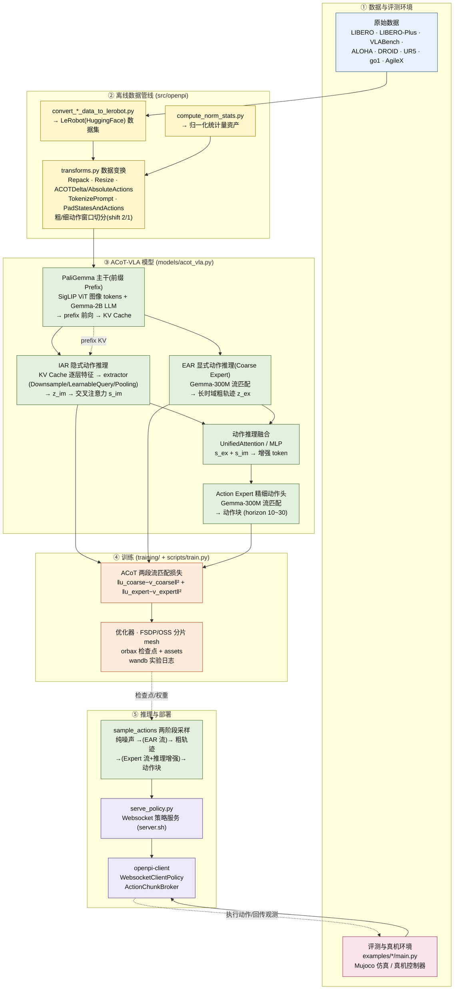

# 架构总览 Architecture

> 📌 **P0 已内置主架构图(渲染验证用)**；配套的分层说明、模块地图表格与推理/训练局部图将由 P2 阶段填充。

**规划内容清单：**

- 系统分层总述：数据与评测环境 / 离线数据管线 / 模型 / 训练 / 推理部署
- 模块地图表(路径 → 职责 → 关键符号)
- 推理链路时序图(sequenceDiagram)
- 训练流程图(两段流匹配损失)

## 主架构图（Mermaid）

