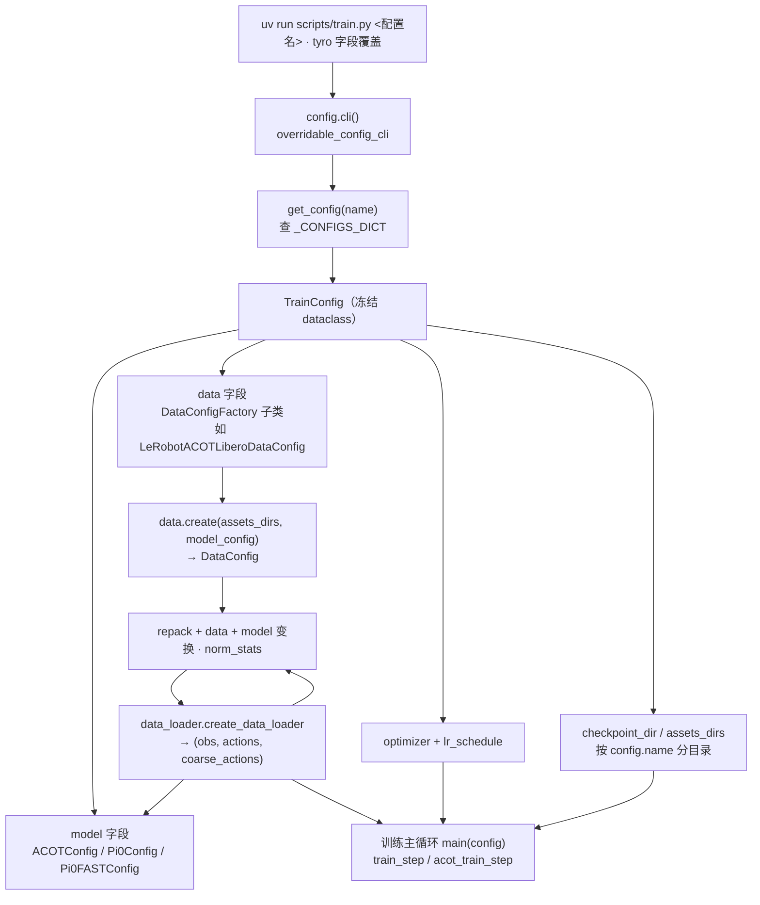

> 核验于源码基线 commit cb9d195。

# 配置中心 Config Center

ACoT-VLA 的"配置"只有一个事实来源：`src/openpi/training/config.py` 里的 `TrainConfig` dataclass（`src/openpi/training/config.py:1150`）。它可以同时描述**模型变体**（pi0 / pi0-5 / pi0_fast / ACOT）、**数据管线**（用哪个数据集、走哪套 repack/data/model 变换）与**训练工程**（优化器、学习率、步数、检查点目录、wandb）。所有命名配置都是 `_CONFIGS` 列表里的 `TrainConfig` 实例（`src/openpi/training/config.py:1241`），运行时经 `get_config(name)` 按名查询（`src/openpi/training/config.py:1951`），命令行则统一由 **tyro** 这一个入口驱动（`cli()`，`src/openpi/training/config.py:1947`）——位置参数选配置名，其余字段全部可用 `--字段` 覆盖。全量清单与每个配置的逐行定义请直接看自动生成的[配置注册表](/generated/config-registry)（本页只做分类与原理讲解，不手抄清单）。



装配路径：`cli()` 用 tyro 把配置名解析成对应 `TrainConfig`（`src/openpi/training/config.py:1947-1948`）；训练入口 `main(config)`（`scripts/train.py:250`）读取 `model`/`data`/优化器字段，`data.create(assets_dirs, model_config)` 产出最终 `DataConfig`（`src/openpi/training/config.py:200`），再交给数据装载（`scripts/train.py:276`）与两步训练步（ACOT 走 `acot_train_step`，分支见 `scripts/train.py:301`）；检查点与 norm-stats 资产按 `config.name` 落盘（`src/openpi/training/config.py:1221`）。服务端同理：`serve_policy.py` 的 `Checkpoint(config, dir)` 两个字符串字段（`scripts/serve_policy.py:26-33`）即"配置名 + 检查点目录"，内部调 `get_config(config)` 还原配置（`scripts/serve_policy.py:98`）。

## 1. 配置注册表

`_CONFIGS` 现含 **25 个命名配置**（运行时校验名字唯一，`src/openpi/training/config.py:1942-1943`）：**17 个 Pi0 族**（pi0 / pi0-5 / pi0_fast 基座）与 **8 个 ACoT 族**（`acot_vla.ACOTConfig`，EAR+IAR 双推理器）。下表按域归类并给出真实配置名示例；**完整 25 项逐字段表见 [/generated/config-registry](/generated/config-registry)**（ACOT 配置名统一为 `<域>_action_cot_explicit_implicit_co_fusion` 或挑战赛专用名）。

| 模型族 | 数据域 | 代表配置名（全名见注册表） | 一句话用途 |
|---|---|---|---|
| Pi0 / Pi0-5 | ALOHA 双臂 | `pi0_aloha`、`pi05_aloha`、`pi0_aloha_pen_uncap`、`pi0_aloha_sim` | 桌面双臂的预训练/迁移/仿真基座（工厂 `LeRobotAlohaDataConfig`） |
| Pi0 / Pi0-5 / Pi0_fast | DROID | `pi0_droid`、`pi0_fast_droid`、`pi0_fast_full_droid_finetune`、`pi05_droid_finetune` | 大规模泛化数据；RLDS 与 LeRobot 两种装载方式各留了条目 |
| Pi0 族 | LIBERO | `pi0_libero`、`pi0_libero_low_mem_finetune`、`pi0_fast_libero`、`pi05_libero` | 单臂仿真基准；`low_mem` 为 LoRA 低显存微调变体 |
| ACoT | LIBERO | `acot_libero_action_cot_explicit_implicit_co_fusion` | coarse 15 / fine 10 窗口的动作思维链微调基座 |
| ACoT | LIBERO-Plus | `acot_libero_plus_action_cot_explicit_implicit_co_fusion` | 长程 LIBERO-Plus，动作键为 `"action"` |
| ACoT | VLABench | `acot_vlabench_action_cot_explicit_implicit_co_fusion` | 10 个 primitive 任务合训，离散状态输入 |
| ACoT | Go1 四足 | `acot_go1_openset_pick_action_cot_explicit_implicit_co_fusion`、`acot_go1_wipe_stain_...`、`acot_go1_pourwater_...` | 三目相机、夹爪+腰部掩码；wipe/pour 开离散状态 |
| ACoT | Agilex | `acot_agilex_openset_pick_action_cot_explicit_implicit_co_fusion` | 真机抓取（coarse/fine 均 30） |
| ACoT | Go2 · ICRA 挑战赛 | `acot_icra_simulation_challenge_reasoning_to_action` | 挑战赛官方入口：9 任务列表 + `prompt_map_inject_to_training` 指令增强（`src/openpi/training/config.py:1817`） |

## 2. TrainConfig 字段速查

`TrainConfig`（`src/openpi/training/config.py:1150`）是**冻结** dataclass，所有字段都有默认值（见 `src/openpi/training/config.py:1151-1213`）。下表按源码顺序列出速查项。

| 字段 | 默认值 / 说明 | 行号 |
|---|---|---|
| `name` | 配置名，注册表键，CLI 位置参数；tyro 抑制字段 | `src/openpi/training/config.py:1152` |
| `project_name` | `"ACOT-VLA"`，wandb 项目名 | `src/openpi/training/config.py:1154` |
| `exp_name` | `tyro.MISSING`，**必填**，决定检查点子目录 | `src/openpi/training/config.py:1156` |
| `model` | `BaseModelConfig`，默认 `Pi0Config()`；ACOT 条目传 `ACOTConfig` | `src/openpi/training/config.py:1161` |
| `weight_loader` | `NoOpWeightLoader`；微调条目常换 `ACOTCheckpointWeightLoader` | `src/openpi/training/config.py:1164` |
| `lr_schedule` | `CosineDecaySchedule` | `src/openpi/training/config.py:1166` |
| `optimizer` | `AdamW`（ACOT 条目常配 `clip_gradient_norm=1.0`） | `src/openpi/training/config.py:1167` |
| `ema_decay` | `0.99`（ACOT 条目用 `0.999`） | `src/openpi/training/config.py:1168` |
| `freeze_filter` | `nnx.Nothing`；条目里由 `ACOTConfig().get_freeze_filter(...)` 给出冻结骨架 | `src/openpi/training/config.py:1171` |
| `data` | `DataConfigFactory`，默认 `FakeDataConfig()`（冒烟即开箱即用） | `src/openpi/training/config.py:1174` |
| `assets_base_dir` / `checkpoint_base_dir` | `"./assets"` / `"./checkpoints"`（相对路径） | `src/openpi/training/config.py:1177` / `src/openpi/training/config.py:1179` |
| `seed` | `42` | `src/openpi/training/config.py:1182` |
| `batch_size` | `32`（须能被设备数整除，见 `scripts/train.py:254`） | `src/openpi/training/config.py:1184` |
| `num_workers` | `2` | `src/openpi/training/config.py:1187` |
| `num_train_steps` / `log_interval` / `save_interval` / `keep_period` | `30_000` / `100` / `1000` / `5000` | `src/openpi/training/config.py:1189` `src/openpi/training/config.py:1192` `src/openpi/training/config.py:1194` `src/openpi/training/config.py:1196` |
| `overwrite` / `resume` | 均 `False`；二者互斥（`src/openpi/training/config.py:1235-1237`） | `src/openpi/training/config.py:1199` / `src/openpi/training/config.py:1201` |
| `wandb_enabled` | `True` | `src/openpi/training/config.py:1204` |
| `policy_metadata` | `dict[str, Any] | None`，透传给策略服务器（如 `reset_pose`） | `src/openpi/training/config.py:1207` |
| `fsdp_devices` | `1`（>1 开 FSDP 分片） | `src/openpi/training/config.py:1213` |

两个派生属性无需手设：`assets_dirs` = `<assets_base_dir>/<name>`（`src/openpi/training/config.py:1216-1218`）；`checkpoint_dir` = `<checkpoint_base_dir>/<name>/<exp_name>`，`exp_name` 为空即抛错（`src/openpi/training/config.py:1221-1228`），`DEBUG_MODE=true` 时改为 `<name>/debug` 且条目内 batch/workers/save 间隔会被整体调小（如 `src/openpi/training/config.py:1605-1607`）——做冒烟测试时非常有用。

## 3. DataConfigFactory 家族

数据部分由 `DataConfigFactory` 抽象类统一（`src/openpi/training/config.py:190`）：每个子类声明自己的可选字段，并实现 `create(assets_dirs, model_config) -> DataConfig`（`src/openpi/training/config.py:200`）。公共装配逻辑在 `create_base_config`：填入 `repo_id`、按 `asset_id` 从 assets 目录装载 norm stats（缺失则跳过）、关掉分位数归一（`src/openpi/training/config.py:203-212`），再 `dataclasses.replace` 叠上 repack/data/model 变换。代码内直接调用的例子：`compute_norm_stats.py` 先 `get_config` 再 `config.data.create(config.assets_dirs, config.model)`（`scripts/compute_norm_stats.py:89-91`）。

| 工厂类 | 服务的数据 / 机器人 | 一句话要点 | 行号 |
|---|---|---|---|
| `FakeDataConfig` | 无（冒烟） | `repo_id="fake"`，数据装载层据此造 `FakeDataset` | `src/openpi/training/config.py:253` |
| `SimpleDataConfig` | 通用 | 直接注入用户给的 data/model 变换工厂（DROID 条目用） | `src/openpi/training/config.py:262` |
| `LeRobotAlohaDataConfig` | ALOHA | 可选关节 delta、`adapt_to_pi` 兼容 pi 内部空间 | `src/openpi/training/config.py:278` |
| `LeRobotLiberoDataConfig` | LIBERO | 文档注释明确"复制本类、改变换即可用于自有数据集" | `src/openpi/training/config.py:331` |
| `LeRobotVLABenchDataConfig` | VLABench | 非 ACoT 对照版 | `src/openpi/training/config.py:407` |
| `LeRobotACOTVLABenchDataConfig` | VLABench + ACoT | 加 `joint_action_shifts=(2,1)`，`acot_action_generation` 用 coarse/fine 双 horizon | `src/openpi/training/config.py:450` |
| `LerobotACOTGo1DataConfig` | Go1 四足 | 三目 repack、state/action/delta 三组掩码、可开 `prompt_from_hl_instruction` | `src/openpi/training/config.py:503` |
| `LerobotACOTGo2DataConfig` | Go2 四足（ICRA） | 掩码剔除夹爪与腰部关节，`prompt_map_inject_to_training` 做提示词注入 | `src/openpi/training/config.py:582` |
| `LeRobotACOTLiberoDataConfig` | LIBERO + ACoT | 参考样板：delta 动作 + coarse/fine 生成 + shifts | `src/openpi/training/config.py:665` |
| `LeRobotACOTLiberoPlusDataConfig` | LIBERO-Plus | 键位按 `observation.images.front/wrist`、动作键 `"action"` | `src/openpi/training/config.py:712` |
| `RLDSDroidDataConfig` | DROID（RLDS） | 大数据量训练；`rlds_data_dir` 必填否则断言失败 | `src/openpi/training/config.py:761` |
| `LeRobotDROIDDataConfig` | DROID（LeRobot） | 小规模 DROID 转 LeRobot 格式的入口 | `src/openpi/training/config.py:813` |
| `LerobotAgilexDataConfig` / `LerobotACOTAgilexDataConfig` | Agilex | 可 `mask_state` / 转 eef；ACOT 版加 shifts | `src/openpi/training/config.py:851` / `src/openpi/training/config.py:927` |
| `LerobotARXDataConfig` / `LerobotACOTARXDataConfig` | ARX | ARX 本体；ACOT 版加 shifts | `src/openpi/training/config.py:1000` / `src/openpi/training/config.py:1073` |

ACoT 家族的一个实现细节：`joint_action_shifts` 等额外字段并不在 `DataConfig` 声明里，而是工厂 `create()` 用 `object.__setattr__` 附加到冻结对象上（如 `src/openpi/training/config.py:708`），随后数据装载层读取它计算取窗长度（`src/openpi/training/data_loader.py:176-183`）——这解释了为什么 ACOT 与非 ACOT 工厂必须分开。

## 4. CLI 用法与覆盖

训练脚本唯一入口是 `main(_config.cli())`（`scripts/train.py:349`），而 `cli()` 用 tyro 的 `overridable_config_cli` 把 `_CONFIGS_DICT` 的名字映射成 CLI（`src/openpi/training/config.py:1947-1948`）。仓库内真实用法（来自 `examples/droid/README_train.md`）：

```bash
uv run scripts/train.py pi0_fast_full_droid_finetune --exp-name=my_experiment --overwrite
uv run scripts/train.py pi05_droid_finetune --exp-name=my_experiment --overwrite
```

即：**第一个位置参数是配置名**，之后任意 `--字段` 覆盖所选配置的对应字段（tyro 把下划线转成连字符，所以 `exp_name` 写作 `--exp-name`）。嵌套字段用点号，例如给任一配置临时换数据源可写 `--data.repo-id=/path/to/my_dataset --num-train-steps=1000`。ACoT 配置名的位置参数用法完全一致，例如：

```bash
uv run scripts/train.py acot_libero_action_cot_explicit_implicit_co_fusion --exp-name=libero_ft --overwrite
```

配套工具 `compute_norm_stats.py` 也是先 `get_config(config_name)` 再装配数据（`scripts/compute_norm_stats.py:89-91`），README 的调用形式为 `uv run scripts/compute_norm_stats.py --config-name <CONFIG_NAME>`。

不想走 CLI 时，代码里用 `get_config(name)` 拿配置即可（`src/openpi/training/config.py:1951-1958`）：服务端在 `scripts/serve_policy.py:98`、`scripts/serve_policy.py:108`，离线 rollout 在 `scripts/openloop.py:15`。名字拼错时 `get_config` 会用 difflib 提示最接近的配置名（`src/openpi/training/config.py:1953-1956`）。

## 5. 新增自有数据集配置

想把自己采集的 LeRobot 格式数据接进来，推荐照 `LeRobotACOTLiberoDataConfig` 的样板改（它是最小的 ACOT 参考实现，`src/openpi/training/config.py:665`）；非 ACoT 则抄 `LeRobotLiberoDataConfig`，其 docstring 明说可复制改造（`src/openpi/training/config.py:332-337`）。手把手流程：

1. **定模型族与参照工厂**：同本体同形态优先复用现有族；弄清你的动作是绝对量还是 delta、有几路相机、状态维度——这些决定后面要动哪些字段。
2. **准备数据集资产**：先算 norm stats——`uv run scripts/compute_norm_stats.py --config-name <CONFIG_NAME>`（脚本内部即走 `data.create`，`scripts/compute_norm_stats.py:89-91`），产物落在 `assets/<config-name>` 下，训练时由 `create_base_config` 自动装载（`src/openpi/training/config.py:203-212`）。
3. **换 `repo_id`**：复制工厂类（或直接新建 `TrainConfig` 条目），把 `repo_id` 换成你的数据集——Hub id 或本机路径均可，也支持列表多数据集合并（见 `src/openpi/training/config.py:1614-1626`、装载在 `src/openpi/training/data_loader.py:185-197`）。
4. **对齐键名**：重写 `repack_transforms` 的键映射，让数据集键对上推理环境键（`src/openpi/training/config.py:673-685`），并确认 `action_sequence_keys`（默认 `("actions",)`，`src/openpi/training/config.py:93`）与 `action_dim`。
5. **动作语义**：LIBERO 原始数据已是 delta；若你的数据是绝对动作，按 `src/openpi/training/config.py:376-393` 注释开启 delta/absolute 变换；ACOT 路径用 `ACOTDeltaActions`（`src/openpi/training/config.py:695-699`），必要时调 `joint_action_shifts` 与 `extra_delta_transform`。
6. **新本体则加策略适配**：当 repack 无法对齐（新相机布局、新状态空间），需要新增策略变换类（如 `agilex_policy.AgilexACOTInputs` 这类 Inputs/Outputs），源码在 `src/openpi/policies/*.py`，模块清单见 [/generated/module-map](/generated/module-map)；真机键对齐参考 [/deploy-real](/deploy-real)。
7. **注册或临时覆盖**：正式使用就在 `_CONFIGS` 末尾追加 `TrainConfig(name=唯一名, ...)`（`src/openpi/training/config.py:1241`，重名启动即报错）；实验性验证可以不注册，直接用 `--data.repo-id=...` 覆盖现有条目。
8. **先冒烟后长训**：先用默认 `FakeDataConfig`（`src/openpi/training/config.py:1174`，数据层造 `FakeDataset`，`src/openpi/training/data_loader.py:173-174`）跑通模型/优化器/保存链路；再开 `DEBUG_MODE=true` 用真实数据小步数验证（batch/workers/save 自动调小，检查点走 `debug/` 子目录），最后关掉 debug 正式训练。

## 6. 常见坑

- **`repo_id` 多为团队内网路径**：25 个条目的 `repo_id` 大量指向 `/mnt/public/...` 本机路径（如 `src/openpi/training/config.py:1588`、ICRA 九任务列表 `src/openpi/training/config.py:1825-1837`）——clone 后不能直接训，必须换成你自己可访问的路径或 Hub id。
- **`assets`/`checkpoints` 是相对路径**：默认 `./assets`、`./checkpoints`（`src/openpi/training/config.py:1177`、`src/openpi/training/config.py:1179`），norm stats 与检查点又按 `config.name` 分目录（`src/openpi/training/config.py:1216-1228`）——务必从仓库根目录运行，否则资产找不到、检查点落错位置。
- **`--exp-name` 必填**：`checkpoint_dir` 在 exp_name 为空时直接抛 `ValueError`（`src/openpi/training/config.py:1223-1224`）；`--resume` 与 `--overwrite` 同开会抛错（`src/openpi/training/config.py:1235-1237`）；`batch_size` 必须能被设备数整除（`scripts/train.py:254`）。
- **ACOT 配置与数据窗口必须配套**：ACOT 数据装载按 `max(coarse_horizon×shift₁, action_horizon×shift₂)` 取动作窗口（`src/openpi/training/data_loader.py:176-183`），工厂把 `(coarse_action_horizon, action_horizon)` 与 `joint_action_shifts` 一起塞给输入变换（如 `src/openpi/training/config.py:690`）。把某条 ACOT 配置的模型换成别的 horizon、或把不同机器人的数据集塞进同一配置，会在数据管线报键缺失/形状不符——每个命名配置的模型字段与其数据工厂是配套出厂的，改一边必须同步改另一边（粗监督还会随 horizon 变长，需要数据集提供足够长的连续片段）。
- **行号随版本漂移**：本页锚点核验于 cb9d195，自动生成的注册表页另标注了其生成 commit——改动代码后行号以 `tools/check_anchors.py` 为准，别把这里的行号当 API。

## 相关页面

- [快速上手 Quickstart](/quickstart) —— 一行命令跑通训练/推理
- [数据管线 Data Pipeline](/data) —— LeRobot 格式与数据集转换
- [模型深潜 Model (EAR/IAR)](/model-acot) —— ACoTConfig 字段与双推理器
- [训练系统 Training](/training) —— 主循环与两步前向
- [推理与服务 Inference](/inference) —— 策略服务器与 rollout
- [评测与竞赛 Evaluation](/evaluation) —— LIBERO/VLABench/ICRA 评测入口
- [配置注册表（自动生成）](/generated/config-registry) —— 25 个命名配置全表
- [模块地图（自动生成）](/generated/module-map) —— `policies/` 与数据管线源码定位
