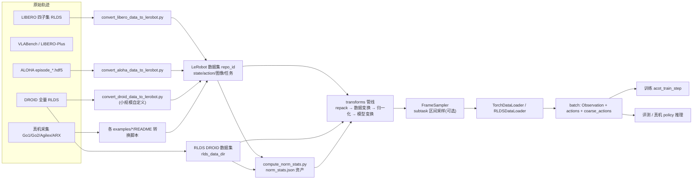

# 数据管线 Data Pipeline

> 核验于源码基线 commit cb9d195 · 本页描述均以真实源码为准。

数据管线回答的问题是：**一条轨迹从"机器人录下来的原始字节"到"喂进模型的 batch"之间发生了什么，以及你加一个新数据集时要改哪些地方。** 在 ACoT-VLA 中，完整生命周期是：原始演示（RLDS/HDF5/真机）→ 转换脚本 → LeRobot 数据集（DROID 全量另走 RLDS）→ 归一化统计量资产 → transforms 变换管线 → FrameSampler 采样 → DataLoader 拼 batch → 训练 / 评测。与普通 pi0 不同，ACoT 模型每个样本还额外消费一段**粗粒度动作窗口**，因此统计量与数据装载都围绕 `state`、`actions`、`coarse_actions` 三个键设计（src/openpi/training/data_loader.py:609；scripts/compute_norm_stats.py:102）。



## 1. 数据格式与生态

**LeRobot 主线。** 除全量 DROID 外，训练数据统一读 LeRobot v2 格式：`DataConfig.repo_id`（src/openpi/training/config.py:72）既可以是 HF 数据集名，也可以是本地目录路径。官方 HF 示例有 `physical-intelligence/libero`（src/openpi/training/config.py:1343）与 `physical-intelligence/aloha_pen_uncap_diverse`（src/openpi/training/config.py:1455）；把多个数据集合并训练时把 `repo_id` 写成列表，由 `MultiLeRobotDataset` 拼接（src/openpi/training/data_loader.py:185-197）。

**本机路径是常态，也是最大的坑。** 仓库内大多数 ACoT 命名配置的 `repo_id` 是作者机器上的 `/mnt/public/...` 路径（如 src/openpi/training/config.py:1588、1615-1626、1680、1825-1837），它们只是示例，**跑任何命令前都要替换成你的本地路径或 HF repo_id**；asset_id 默认取 repo_id（src/openpi/training/config.py:205），本机路径会让统计量资产目录随之变得很长。

**DROID 特例。** 全量 DROID（约 1.8TB）改用 RLDS 格式以求吞吐，配置走 `RLDSDroidDataConfig`（src/openpi/training/config.py:762-810），通过 `rlds_data_dir` + `action_space` 指定数据源与动作空间（src/openpi/training/config.py:1526-1529）；它需要额外依赖（`uv sync --group rlds`），见 src/openpi/training/data_loader.py:401 与 `examples/droid/README_train.md`。自定义的小规模 DROID 数据（<10 小时）仍建议转成 LeRobot，模板见 `LeRobotDROIDDataConfig`（src/openpi/training/config.py:814-849）。各机器人的动作空间约定（关节角弧度、夹爪 [0,1]、控制频率等）见仓库 `docs/norm_stats.md`。

## 2. 数据转换脚本

| 脚本 | 输入 → 输出 | 关键参数 | 运行示例（仓库根目录） |
|---|---|---|---|
| `examples/libero/convert_libero_data_to_lerobot.py` | 4 个 LIBERO RLDS 子集 `libero_{10,goal,object,spatial}_no_noops`（行 29-34）→ LeRobot：fps=10，state(8)/actions(7)/双图 256²（行 46-71） | `--data_dir` 指向原始 RLDS；`--push_to_hub` 上传；产物落 `$LEROBOT_HOME/<repo_id>`（行 39） | `uv run examples/libero/convert_libero_data_to_lerobot.py --data_dir /path/to/raw --push_to_hub`（行 7-11；需先 `uv pip install tensorflow tensorflow_datasets`，行 13-14） |
| `examples/droid/convert_droid_data_to_lerobot.py` | DROID 原始数据（trajectory + `recordings/MP4` + 语言标注）→ LeRobot：fps=15，外置×2+腕部 180×320、joint_position(7)+gripper(1)+actions(8，关节速度)（行 47-83） | 同上；输出 `$HF_LEROBOT_HOME/<repo_id>`（行 39） | `uv run examples/droid/convert_droid_data_to_lerobot.py --data_dir <...>`（examples/droid/README_train.md 第 79 行） |
| `examples/aloha_real/convert_aloha_data_to_lerobot.py` | 逐段 `episode_*.hdf5`（行 249）→ LeRobot：fps=50（行 117），14 电机 + 4 相机（行 43-64） | `--raw-dir`、`--repo-id <org>/<name>`；默认 `push_to_hub=True`（行 236） | `uv run examples/aloha_real/convert_aloha_data_to_lerobot.py --raw-dir /path/to/raw --repo-id <org>/<name>`（行 4） |

转换脚本产出的 `REPO_NAME` 均为占位符（如 `your_hf_username/libero`，行 28），请改成你的仓库名；Go1/Go2/Agilex/ARX 等真机数据则按各 `examples/*/README` 的采集-转换流程产出 LeRobot 数据集。转换只做"格式搬运"：**归一化统计量不在这里算**（libero 脚本显式 `run_compute_stats=False`，行 93），而是下一步单独算。

## 3. 归一化统计量

训练/推理都会把 proprio 状态与动作目标归一化：默认 z-score（`(x-mean)/(std+1e-6)`，src/openpi/transforms.py:139-141），也可在配置里开分位归一化（q01/q99 映射到 [-1,1]，src/openpi/transforms.py:143-147；开启前提是统计量带分位，src/openpi/transforms.py:545-550）。归一化紧跟在 repack 与数据变换之后、模型变换之前（src/openpi/training/data_loader.py:257-265）；统计量缺失时训练会直接报错并提示先跑统计脚本（src/openpi/training/data_loader.py:250-254）。

用 `compute_norm_stats.py` 为指定配置计算统计量，它会按配置打开数据集并遍历 `state`/`actions`/`coarse_actions` 三键的 10% 批次样本（scripts/compute_norm_stats.py:102-106）：

```bash
uv run scripts/compute_norm_stats.py --config-name <CONFIG_NAME> [--max-frames N]
```

`RunningStats` 用 5000 桶直方图在线估计 q01/q99（src/openpi/shared/normalize.py:28、86-87），最终产出 `norm_stats.json` 写到当前目录（scripts/compute_norm_stats.py:131-133；src/openpi/shared/normalize.py:135-139）。加载侧 `NormStats` 含 `mean/std/q01/q99` 四段（src/openpi/shared/normalize.py:10-14）：数据管线按 `assets_dir/<asset_id>/norm_stats.json` 查找（src/openpi/training/config.py:210、214-226，支持 gs:// 远端并落本地缓存），`asset_id` 缺省等于 `repo_id`（src/openpi/training/config.py:205）；多数据集时会对各份统计量逐键取平均（src/openpi/training/config.py:230-242）。**实际使用前，请把上一步生成的 `norm_stats.json` 放进 `./assets/<配置名>/<asset_id>/`**（`assets_base_dir` 默认 `./assets`，src/openpi/training/config.py:1177、1216-1218），或像 `pi0_aloha_pen_uncap` 那样用 `AssetsConfig` 直接复用预训练资产（src/openpi/training/config.py:1456-1459）。注意该脚本按 ACoT 三键设计：对不产出 `coarse_actions` 的普通 pi0 配置，收尾聚合会因零样本抛错（src/openpi/shared/normalize.py:81-82），请改用 ACoT 配置或直接沿用预训练资产。

## 4. transforms 变换管线

变换都是无状态的 `DataTransformFn`（src/openpi/transforms.py:26），按 `inputs`（进模型前）与 `outputs`（仅推理、出模型后）分组（src/openpi/transforms.py:42-61），顺序即 `repack → data_transforms → Normalize → model_transforms`（src/openpi/training/data_loader.py:246-265）。每个数据集工厂在 `create()` 里装配三组变换（以 `LeRobotLiberoDataConfig` 为模板，src/openpi/training/config.py:332-405）。

| 变换（行号） | 作用 |
|---|---|
| `RepackTransform`（transforms.py:82） | 按映射把数据集键重命名到策略/推理统一键，如 `observation.image`→`image`（config.py:353-361） |
| `InjectDefaultPrompt`（transforms.py:107） | 数据无 `prompt` 时注入默认指令 |
| `ResizeImages`（transforms.py:187） | 图像等比缩放补边到 224×224 |
| `Normalize` / `Unnormalize`（transforms.py:117 / 151） | 见第 3 节；推理出模型后反归一化 |
| `DeltaActions` / `AbsoluteActions`（transforms.py:215 / 237） | 绝对动作 ↔ 相对当前 state 的增量动作，mask 控制哪些维做 |
| `TokenizePrompt`（transforms.py:297） | PaliGemma 分词；`discrete_state_input=True` 时把状态也词元化（行 299、305-307） |
| `PromptFromLeRobotTask`（transforms.py:359） | 由 `task_index` 从 `dataset.meta.tasks` 取指令（需 `prompt_from_task=True`） |
| `PromptFromHighlevelInstruction`（transforms.py:376） | 长程分段数据：按 `episode_index/frame_index` 落进哪段 `instruction_segments` 取对应子指令 |
| `PadStatesAndActions`（transforms.py:405） | 把 state/actions 零填充到 `model_action_dim` |

**ACoT 特有差异**：它把上面的 `DeltaActions`/`AbsoluteActions`/`Pad` 都换成双键版本——`ACOTDeltaActions` 与 `ACOTAbsoluteActions`（src/openpi/transforms.py:258 / 278）会同时处理 `coarse_actions` 与 `actions` 两个键，且每个键是否转增量由 `extra_delta_transform` 二元组逐键控制（如 LIBERO 原始即为增量，故 `(False, False)`，src/openpi/training/config.py:666-669）；`ACOTPadStatesAndActions`（src/openpi/transforms.py:417-428）把两键都 pad 到动作维。模型侧由 `ModelTransformFactory` 按 `model_type` 分派（src/openpi/training/config.py:120-187），ACOT 分支把 `ACOTPadStatesAndActions` 置于末位（config.py:155、168）。增量 mask 用 `make_bool_mask` 生成：LIBERO 取 `(6,-1)` 即前 6 维关节增量、夹爪绝对（src/openpi/training/config.py:695），DROID 关节位置动作空间取 `(7,-1)`（src/openpi/training/config.py:792-797）。

## 5. ACOT 双窗口语义

普通 pi0 每个样本只有一段 `actions`（长度 = `action_horizon`）；ACoT 额外引入**粗动作窗口 `coarse_actions`**，长度由模型配置的 `coarse_action_horizon` 决定（默认 50，src/openpi/models/acot_vla.py:275）。

**窗口长度**：数据装载时先算 `chunk = max((coarse_action_horizon, action_horizon) × joint_action_shifts)`，其中 `joint_action_shifts` 是数据工厂字段、运行时被注入 DataConfig（默认 `(2,1)`，如 src/openpi/training/config.py:454、666-669；动态写入见 config.py:499）；LeRobot 再按 `action_chunk_size` 帧的 `delta_timestamps` 开窗读出原始动作串（src/openpi/training/data_loader.py:176-180、192-197）。

**粗/细窗口生成（训练与推理同一变换）**：策略输入变换按 `raw[: (horizon-1)*shift + 1 : shift]` 从该窗口采样——即细窗取前 `action_horizon` 帧连续动作，粗窗按步长 2 覆盖约两倍物理时长的轨迹（src/openpi/policies/libero_policy.py:131-142，arx/go1/go2/aloha/agilex/vlabench 同款）。例：LIBERO-ACoT 配置 `coarse=15, fine=10`（src/openpi/training/config.py:1586），`chunk = max(15×2, 10×1) = 30` 帧：`actions` 为前 10 帧，`coarse_actions` 为第 0,2,…,28 帧共 15 个。真机长程配置常用 30/30（src/openpi/training/config.py:1678、1821），此时 chunk=60 帧。

**消费端**：训练时 `DataLoaderACOTImpl` 逐 batch 产出 `(Observation, actions, coarse_actions)` 三元组（src/openpi/training/data_loader.py:599-609），`acot_train_step` 解包后把粗轨迹作为显式推理器的流匹配回归目标（scripts/train.py:206-215；src/openpi/models/acot_vla.py:699-716）。推理时模型一次采样出粗/细两段并同时返回（src/openpi/models/acot_vla.py:899），再由输出变换截掉 pad 维、按机器人维数切回（src/openpi/policies/libero_policy.py:154-159）。horizon/双窗相关的所有可调项汇总见 /config-center。

## 6. DataLoader 装配

入口是 `create_data_loader`（src/openpi/training/data_loader.py:297），按 `rlds_data_dir` 是否为 None 分流：

- **LeRobot / torch 侧**（src/openpi/training/data_loader.py:332-386）：`create_torch_dataset`（单 repo / 列表 / `"fake"` 假数据，src/openpi/training/data_loader.py:166-226）→ `transform_dataset` 套变换 → 若 `DataConfig.dataloader_sampler` 非空则挂 `FrameSampler`（行 365-369）→ `SafeDataset` 容错包裹 → `TorchDataLoader`（行 427-489，`num_workers>0` 时用 spawn 上下文，行 471-473；worker 内关闭 JAX 显存预分配，行 535-540）。ACoT 模型包 `DataLoaderACOTImpl` 产出三元组，pi0 走 `DataLoaderImpl` 产出 `(Observation, actions)`（行 383-386、587-609）。
- **RLDS / DROID 侧**（行 389-424）：`DroidRldsDataset` 内部自带批处理，`RLDSDataLoader` 只是薄包装（行 543-547），batch 以 `is_batched=True` 过变换（行 416）。
- **FrameSampler**：`dataloader_sampler="subtask"` 时启用（src/openpi/training/sampler.py:66-82），只采样落在 `instruction_segments` 定义的成功区间内的帧（行 12-63：区间取 `[start_frame_index, success_frame_index]`，行 44-45；含 reset/return 的子段截断为 45 帧，行 48-52），用于长程分段真机数据（示例：src/openpi/training/config.py:1682）。
- **并行度**：torch 侧 `num_workers` 默认 2（config.py:1187），ACoT 配置常开到 48（config.py:1606）；RLDS 侧必须为 0（config.py:1543，注释明确说明）。

## 7. 常见坑

1. **repo_id 是作者本机路径**：大量 ACoT 配置的 `repo_id`/`assets` 指向 `/mnt/public/...`（src/openpi/training/config.py:1588、1615-1626、1825-1841），不改就跑——必先替换为你的路径或 HF repo_id，并同步确认统计量资产目录（第 1、3 节）。
2. **HF 下载与断点**：LeRobot/远端资产都经缓存目录下载（src/openpi/training/config.py:226 走 `maybe_download`），首次体量以十 GB 计；LIBERO 原始 RLDS 需 `tensorflow_datasets`（examples/libero/convert_libero_data_to_lerobot.py:13-14），DROID 全量需 `gsutil` 拉取且磁盘要求 1.8TB（examples/droid/README_train.md 第 20-27 行）。转换产物默认在 `$LEROBOT_HOME` / `$HF_LEROBOT_HOME`，改数据后请清理旧目录再重转（脚本开头 `shutil.rmtree`）。
3. **norm stats 与数据集不匹配**：缺失资产只会在加载层打日志跳过（config.py:248-250），而 `apply_tree` 对"统计量里没有的键"静默放行、不做归一化（src/openpi/transforms.py:500-503）——若复用只含 state/actions 的普通 pi0 资产训 ACoT，`coarse_actions` 会以原始量级进网络；反之统计脚本又不产出 pi0 所需。务必让统计键与模型键一致（第 3 节）。
4. **ACoT 数据集要能提供双窗口**：LeRobot 每次要读 `chunk = max(h×s)` 帧连续窗口（data_loader.py:178-180），过短片段、低帧率数据集都会让窗口不足；`DataLoaderACOTImpl` 强制 batch 含 `coarse_actions`（data_loader.py:609），若模型类型与数据工厂不匹配（如 ACoT 模型配普通 `LeRobotLiberoDataConfig`）会直接缺键报错。`joint_action_shifts` 仅对 ACOT 数据工厂生效，普通 pi0 配置没有该字段。
5. **DROID RLDS 依赖**：需要 `uv sync --group rlds` 且 `num_workers=0`（src/openpi/training/data_loader.py:401；src/openpi/training/config.py:1543），并自行把 `rlds_data_dir` 指向下载目录（config.py:1528）。
6. **subtask 采样依赖 `instruction_segments` 元数据**：开了 `dataloader_sampler="subtask"` 但数据集 meta 没有该字段时，有效区间为空、采样器空转（src/openpi/training/sampler.py:39、94-108）；Go1/Go2 长程数据转换时务必写入该元数据并配 `prompt_from_hl_instruction=True`（config.py:1682）。
7. **prompt 来源错误**：`prompt_from_task=True` 要求数据集保存过任务（`save_episode(task=...)`）且样本带 `task_index`，否则 `PromptFromLeRobotTask` 直接抛错（src/openpi/transforms.py:366-371）；LIBERO 转 LeRobot 脚本正是靠 `task=` 写入语言指令（examples/libero/convert_libero_data_to_lerobot.py:90）。

## 相关页面

- 快速走通"转换→统计→训练"闭环：[快速上手](/quickstart)
- 所有可调字段与命名配置清单：[配置中心](/config-center)
- 双窗口动作如何在模型内被消费：[ACoT 模型 (EAR/IAR)](/model-acot)
- 训练主循环如何消费三元组 batch：[训练系统](/training)
- 评测/真机端如何使用推理输出：[评测与竞赛](/evaluation)
