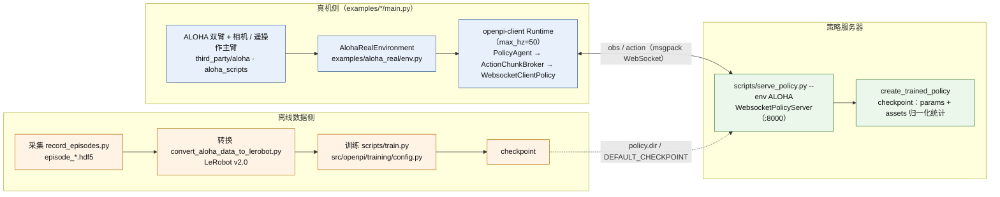

> 核验于源码基线 commit cb9d195。

# 真机部署 Real-Robot

训练好的 checkpoint 如何驱动一台真实机器人？ACoT-VLA 沿用 OpenPI 的**客户端-服务器**接线模式：`scripts/serve_policy.py` 把 checkpoint 变成一个 WebSocket 策略服务器，`openpi-client` 的 runtime 把"机器人"抽象成 `Environment`、把"决策者"抽象成 `Agent`，在主机侧逐帧驱动观测→动作闭环。仓库随附了可直接跑的真机/闭环示例：`examples/aloha_real`（ALOHA 双机械臂真机全流程）、`examples/aloha_sim`（同构的无硬件闭环）、`examples/droid`（DROID 控制笔记本远程查询策略服务器）；其余本体（UR5 / go1 / go2 / AgileX / ARX）以策略适配层或接入模板的形式给出，本文一并说明。

## 1. 部署架构

`serve_policy.py` 定义了 `EnvMode` 枚举（真实取值：`ALOHA`、`ALOHA_SIM`、`DROID`、`LIBERO`、`VLABENCH`、`LIBEROPLUS`、`G2SIM`，见 `scripts/serve_policy.py:14-23`），并用 `DEFAULT_CHECKPOINT` 把每个环境映射到一份默认配置与 checkpoint 目录（`scripts/serve_policy.py:62-91`）：其中 ALOHA/ALOHA_SIM/DROID 指向 pi0 系列远端 `gs://` checkpoint，LIBERO/VLABENCH/LIBEROPLUS/G2SIM 则默认指向本地 `acot_*` 的 `./checkpoints/...` 目录；自训权重一律用 `--policy.config=<config> --policy.dir=<dir>` 显式指定（`scripts/serve_policy.py:103-111`）。服务端在 `0.0.0.0:8000` 上起 `WebsocketPolicyServer`（`scripts/serve_policy.py:126-132`）：连接建立后先推送 `metadata`（含 `reset_pose` 等），此后每收到一帧观测就 `policy.infer` 并回发动作与 `server_timing` 计时（`src/openpi/serving/websocket_policy_server.py:48-72`）。

真机主循环在 `openpi-client` 的 runtime：每步依次 `get_observation → agent.get_action → apply_action`，按 `max_hz` 节流（`packages/openpi-client/src/openpi_client/runtime/runtime.py:60-74`），整轮结束后还会对环境做一次最终 `reset` 让机器人归位（`packages/openpi-client/src/openpi_client/runtime/runtime.py:37-38`）。agent 侧由 `PolicyAgent` 包一层（`packages/openpi-client/src/openpi_client/runtime/agents/policy_agent.py:7-18`），`WebsocketClientPolicy` 负责与服务器的同步阻塞通信（`packages/openpi-client/src/openpi_client/websocket_client_policy.py:12-51`）。控制频率与推理频率之间的解耦靠 `ActionChunkBroker`：它假设动作首维是块长，只在当前块耗尽时才向远端发起一次新的 infer，每次只吐块内一步（`packages/openpi-client/src/openpi_client/action_chunk_broker.py:10-16,27-44`）——网络往返被摊到整块执行时间上。协议与采样细节另见 [推理与服务](/inference)。

## 2. ALOHA 真机闭环（examples/aloha_real）

`third_party/aloha` 是 git 子模块（指向 Physical-Intelligence 的 ALOHA fork，改装 RealSense 相机），遥操作采集/回放脚本（`record_episodes.py`、`replay_episodes.py`、`one_side_teleop.py`）都在其 `aloha_scripts/` 下；README 要求先按 ALOHA 仓库做硬件安装，并把 `aloha_scripts/realsense_publisher.py` 里的相机序列号改成自己的（`examples/aloha_real/README.md`）。整条链路为：

1. **遥操作采集**：`roslaunch aloha ros_nodes.launch` 启动 ROS 节点（README 终端 2），用 fork 内的脚本录制逐 episode 的 `episode_*.hdf5`（转换脚本按该文件名模式读取，见下）。
2. **数据转换**：`uv run examples/aloha_real/convert_aloha_data_to_lerobot.py --raw-dir <dir> --repo-id <org>/<name>`（用法见该文件 docstring），`port_aloha` 按 `episode_*.hdf5` 逐个 episode 转成 LeRobot v2.0：14 个电机（左右臂各 6 关节 + 夹爪）、4 路相机、`fps=50`（`examples/aloha_real/convert_aloha_data_to_lerobot.py:43-64,117,229`）。
3. **训练**：参考自训数据配置模板 `pi0_aloha_pen_uncap`（`src/openpi/training/config.py:1452`），README 建议复用 base checkpoint 中 `trossen` 资产的归一化统计。
4. **部署运行**：Docker 一行 `export SERVER_ARGS="--env ALOHA --default_prompt='...'" && docker compose -f examples/aloha_real/compose.yml up --build`；无 Docker 则三个终端分别跑 `python -m examples.aloha_real.main`、`roslaunch aloha ros_nodes.launch`、`uv run scripts/serve_policy.py --env ALOHA ...`（README 对应小节）。

运行侧事实：`Args` 默认 `action_horizon=25`、`max_hz=50`、每 episode 最多 1000 步（`examples/aloha_real/main.py:18-21,41`）；复位位姿取自服务器 `metadata["reset_pose"]`（`examples/aloha_real/main.py:31-33`，该键由 ALOHA 系配置写入 `policy_metadata`，见 `src/openpi/training/config.py:1251-1259`）。`AlohaRealEnvironment` 对外只暴露 `state`（qpos 14 维）与缩放到 224×224 的 4 路图像 `cam_high/cam_low/cam_left_wrist/cam_right_wrist`，并在入口丢弃 `_depth` 键（`examples/aloha_real/env.py:40-53`）——若把多出来的键传给策略会触发 `ValueError`（`src/openpi/policies/aloha_policy.py:46-47`）。`RealEnv` 的观测/动作空间为绝对关节位置 + 归一化夹爪（0 闭合 / 1 张开，`examples/aloha_real/real_env.py:18-37`），每步以非阻塞 `set_joint_positions` 下发并按 `DT=0.001` 秒休眠（`examples/aloha_real/real_env.py:150-157`、`examples/aloha_real/constants.py:7`）；每 episode 复位时还会重启夹爪电机、先合后开（`examples/aloha_real/real_env.py:114-126,139-148`）。compose 里 runtime / aloha_ros_nodes / ros_master / openpi_server 四个服务共享 host 网络且 `privileged`，以直通 `/dev` 与 GPU（`examples/aloha_real/compose.yml:4-20,59-66`）。

## 3. ALOHA 仿真对偶（examples/aloha_sim）

`examples/aloha_sim` 与真机共享同一套 runtime + broker 写法，仅把 `Environment` 换成 Gymnasium 封装的 `gym_aloha` 任务（默认 `gym_aloha/AlohaTransferCube-v0`），并默认 `action_horizon=10`、`max_hz=50`，用 `VideoSaver` 订阅器把每轮 rollout 落盘成 mp4（`examples/aloha_sim/main.py:14-50`）；仿真观测只取顶部相机并映射为 `cam_high`（`examples/aloha_sim/env.py:47-56`）。它是**无真机验证闭环**的最短路径：`MUJOCO_GL=egl python examples/aloha_sim/main.py` + `uv run scripts/serve_policy.py --env ALOHA_SIM` 两个进程即可跑通（对应 README），建议在真机之前先在 sim 上验证模型、动作块与频率设置。

## 4. DROID

DROID 示例演示了**远程 GPU 机 + 控制笔记本**的典型部署（`examples/droid/README.md`）：在有 GPU 的机器上 `uv run scripts/serve_policy.py --env=DROID`（等价于 `--policy.config=pi0_fast_droid --policy.dir=gs://openpi-assets/checkpoints/pi0_fast_droid`，`examples/droid/README.md:13-20`）；把 `examples/droid/main.py` 拷入 `$DROID_ROOT/scripts`，填入 ZED 相机 id 与 `--external_camera=left|right`（本策略只吃一个外部相机加腕相机），再 `--remote_host/--remote_port` 指向服务器。代码要点：`RobotEnv(action_space="joint_velocity", gripper_action_space="position")`（`examples/droid/main.py:80`）；服务器返回 10×8 的动作块，客户端每执行 `open_loop_horizon=8` 步（约 0.5 秒）才重新查询（`examples/droid/main.py:41-42,113-134`）；夹爪动作按 0.5 阈值二值化、整向量裁剪到 [-1, 1]（`examples/droid/main.py:140-149`）；执行节流到 15 Hz 与 DROID 采集频率对齐（`examples/droid/main.py:23,153-156`）。诚实地说，它的复杂点在于：需要 DROID 两机软件栈、相机 id 与视角人工核对，且 README 明示每块推理 0.5–1 秒延迟属正常，需有线网络。

训练侧另有两条路：**全量 DROID 用 RLDS**——由于 LeRobot 对大库扩展性不足，需 `uv sync --group rlds` 安装额外依赖（`examples/droid/README_train.md:6-14`），数据下载约需 1.8 TB（`examples/droid/README_train.md:27`），`pi0_fast_full_droid_finetune` 配置使用 `JOINT_POSITION` 动作空间（`src/openpi/training/config.py:1519,1529`）——README 明确不建议用 joint velocity 动作训练；**小规模自采数据**则走 `convert_droid_data_to_lerobot.py` 转 LeRobot 后微调 `pi05_droid_finetune`（`examples/droid/README_train.md:56-90`）。

## 5. 其他本体（策略适配表）

go1 / go2 / AgileX / ARX 在仓库中体现为 `src/openpi/policies/` 下的输入/输出适配器（真机客户端不在 `examples/` 内随附），UR5 给出的是接入模板说明。下表仅收录可证实的维度与映射事实：

| 本体 | 策略适配 | 要点（观测 / 动作） |
| --- | --- | --- |
| UR5（6 轴 + 夹爪） | `examples/ur5/README.md`（接入模板） | `state`=joints+gripper；图像 `base_0_rgb`+`left_wrist_0_rgb`，右腕槽位补零并按模型类型 mask；动作截前 7 维；可对前 6 关节做 DeltaActions 增量 |
| go1 | `go1_policy.py` | 相机 `top_head/hand_left/hand_right`→`base_0_rgb` 等；state 先 `pad_to_dim` 到 action_dim；`Go1Outputs` 截前 22 维、`Go1ACOTOutputs` 截前 16 维（`src/openpi/policies/go1_policy.py:96-100,198-204`） |
| go2 | `go2_policy.py` | 同上三相机；训练侧内置按原始宽度（state 183/159、action 40）切片重排的 `slice_state_and_action`（`src/openpi/policies/go2_policy.py:122-136`）；`Go2Outputs` 截前 22 维、`Go2ACOTOutputs` 截前 21 维（`src/openpi/policies/go2_policy.py:95-99,238-243`） |
| AgileX（双臂各 6 轴 + 夹爪） | `agilex_policy.py` + `agilex_fk.py` | 三相机同 go1；关节值越界（\>|π|）清零；可选 `convert_to_eef_position` 先做 FK 再入模；`AgilexOutputs` 截前 14 维（`src/openpi/policies/agilex_policy.py:119-125`） |
| ARX | `arx_policy.py` | 三相机同 go1；state/actions 补齐 action_dim 并可经 `state_mask/action_mask` 清零；`ARXOutputs` 硬编码截前 14 维（`src/openpi/policies/arx_policy.py:95-100`） |

其中 go1、AgileX 的 ACoT 训练配置已注册（如 `acot_go1_openset_pick_*`、`acot_agilex_openset_pick_*`，`src/openpi/training/config.py:1677,1773`），但其数据集 repo_id 为本地路径，需自行准备数据。

## 6. 策略适配层详解

所有 `*_policy.py` 承担同一职责：**输入端**把本体键名翻译成模型键（`image`/`image_mask`/`state`/`prompt`，必要时把图像从 float `C,H,W` 规整为 uint8 `H,W,C`），**输出端**把模型动作截断/换算回本体动作空间。图像约定上，缺失的腕相机槽位用零图 + `image_mask=False` 顶替（pi0-FAST 不 mask 填充位，见 `src/openpi/policies/aloha_policy.py:60-70` 与 `src/openpi/policies/libero_policy.py:59-68`）。ALOHA 特有的是 `adapt_to_pi`：把 ALOHA 与 pi0 之间的关节符号翻转（`_joint_flip_mask`）与夹爪弧度归一化互相转换（`src/openpi/policies/aloha_policy.py:194-240`）。

归一化发生在服务器侧：`create_trained_policy` 把 `InjectDefaultPrompt → Inputs → Normalize(norm_stats) → 模型`、输出端 `Unnormalize → Outputs` 串成一条变换链，且 norm_stats **必须**从 checkpoint 的 assets 目录加载以保证与训练一致（`src/openpi/policies/policy_config.py:44-65`）。ACoT 模型的输出是含 `coarse_actions` 与 `actions` 两个键的字典，输出变换会分别截断（如 `src/openpi/policies/aloha_policy.py:189-192`），真机端应消费 `actions`。动作维度与归一化的模型侧说明见 [模型深潜](/model-acot) 与 [数据管线](/data)。

AgileX 另带纯 NumPy 的运动学模块 `agilex_fk.py`：`C_PiperForwardKinematics` 用 DH 参数（`src/openpi/policies/agilex_fk.py:16-19`）逐链节连乘，`CalFK` 返回各链节位姿（`src/openpi/policies/agilex_fk.py:111-141`）；`qpos_to_eef_pos` 把 14 维（双臂各 6 关节 + 夹爪）换算成末端 xyz（实现内由毫米/度折成米/弧度，`src/openpi/policies/agilex_fk.py:144-197`）。仓库内未发现 IK 逆解实现——只提供**正运动学**。

## 7. 常见坑

1. **相机键名与数量**：ALOHA 真机期望恰好 4 路（`cam_high/cam_low/cam_left_wrist/cam_right_wrist`，订阅关系见 `examples/aloha_real/robot_utils.py:23`），多传（如 `_depth`）会报 `ValueError`；DROID 则只喂一个外部相机 + 腕相机（`examples/droid/main.py:119-127`），且代码注释说明模型只训练过左目立体相机（`examples/droid/main.py:201-203`）。
2. **关节维度与 action_dim 对齐**：状态/动作宽度必须匹配该本体约定——ALOHA qpos 14 维（`examples/aloha_real/real_env.py:26-29`），DROID 输出 8 维（`src/openpi/policies/droid_policy.py:77-81`），UR5 模板 7 维；宽度不足会由 `pad_to_dim` 补零，多余维度被输出变换截断。
3. **绝对/增量、位置/速度语义**：ALOHA 真机执行的是**绝对关节位置**（`set_joint_positions`，`examples/aloha_real/real_env.py:150-155`）；DROID 采用 joint velocity 动作空间并在执行端裁剪到 [-1, 1]（`examples/droid/main.py:80,149`）；UR5 模板对前 6 关节转 delta 增量。环境动作空间必须与策略适配层约定一致。
4. **夹爪约定**：ALOHA 夹爪为归一化位置（0 闭合 / 1 张开，`examples/aloha_real/real_env.py:21-24`），DROID 客户端按 0.5 阈值二值化（`examples/droid/main.py:140-146`）——把模型输出直接灌给机器人前先确认夹爪维度与朝向。
5. **控制频率与 broker**：`Runtime` 的 `max_hz` 决定控制节拍，`ActionChunkBroker` 只在块耗尽时才查询远端（`packages/openpi-client/src/openpi_client/action_chunk_broker.py:41-42`）；ALOHA 真机默认块长 25 @ 50 Hz，即每次推理约覆盖 0.5 秒执行，块长应与任务所需反应速度匹配。
6. **安全与联调顺序**（通用建议）：先跑 ALOHA 仿真闭环（见本文第 3 节）验证整条链路，再上真机；首测时清空工作区、以低速试跑并保证急停与人在回路可用；`--env ALOHA` 等预设只对默认 checkpoint 生效，自训权重务必用 `--policy.config/--policy.dir` 显式指定（`scripts/serve_policy.py:103-111`）；若怀疑服务器是瓶颈，读取响应里的 `server_timing`（`src/openpi/serving/websocket_policy_server.py:64-66`）。

## 相关页面

- [快速上手 Quickstart](/quickstart) —— 安装、数据准备与一行命令跑通训练/推理
- [数据管线 Data Pipeline](/data) —— LeRobot 格式、各数据集转换与归一化统计
- [模型深潜 Model (EAR/IAR)](/model-acot) —— 动作维度、双动作专家与推理融合
- [训练系统 Training](/training) —— checkpoint 结构与 assets 资产
- [推理与服务 Inference](/inference) —— 策略服务器协议、broker 与 rollout
- [配置中心 Config Center](/config-center) —— ALOHA/DROID/go1/agilex 等配置条目
- [附录 Appendix](/appendix) —— 目录树快照与术语表
