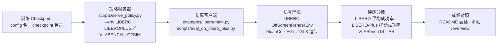

> 核验于源码基线 commit cb9d195。

# 评测与竞赛 Evaluation

本页服务两类读者：想**逐项复现 README 基准成绩**的人，以及准备参加 **AgiBot World Challenge @ ICRA 2026（Reasoning to Action 赛道）**的人。仓库覆盖三套仿真基准——LIBERO、LIBERO-Plus、VLABench——外加 ICRA 挑战赛官方 baseline，复现路径遵循同一架构：**先启动策略服务器，仿真客户端再以"观测→动作块"闭环查询策略**——两端客户端都经 `WebsocketClientPolicy(host, port)` 连接服务器（`examples/libero/main.py:84`、`scripts/eval_on_libero_plus.py:80`），服务器侧"环境→默认 checkpoint"映射见 `scripts/serve_policy.py:62-91`。全部成绩数字与 Frozen / SFT / \* 复现注记见 [/overview](/overview)（逐格照抄 README），本页只讲怎么跑。



## 1. 基准与指标

- **LIBERO**：按任务套件（spatial / object / goal / 10 / 90）逐任务 rollout，以环境 `done` 计成功率，汇报各套件与总平均成功率（%）。README 成绩表列为 Spatial / Object / Goal / Long / Avg（README.md:58-65），"Long"对应长程套件。单任务默认跑 50 个 episode（`examples/libero/main.py:45`）。
- **LIBERO-Plus**：在 LIBERO 上叠加扰动，按扰动类别聚合成功率。README 表将扰动分为 **Camera / Robot / Language / Light / Background / Noise / Layout** 七类并附 Avg（README.md:71-80）；**Zero-Shot** 指用 LIBERO 权重直接评测，**SFT** 指在 LIBERO-Plus 训练集上微调，带 \* 者为官方 checkpoint 复现，**Frozen** 表示训练时冻结 LLM 主干（README.md:82）。
- **VLABench**：比较 **Intention Score (IS)** 与 **Progress Score (PS)**，赛道含 In-dist. / Category / Commonsense / Instruction / Texture（README.md:88-94）。

## 2. 复现 LIBERO

LIBERO 评测入口是 `examples/libero/main.py`：它初始化指定套件的任务与 OffScreenRenderEnv（`examples/libero/main.py:96-108`），每 episode 先等待 `num_steps_wait=10` 步让物体落稳、把图像旋转 180° 并 resize 到 224 后拼成观测（`examples/libero/main.py:124-158`），再向服务器 `infer` 取动作块、每 `replan_steps=5` 步重新规划（`examples/libero/main.py:161-168`）。成功/失败 rollout 都会按 `./libero_videos/<exp>/<suite>/{success,failure}` 存 mp4，最终打印总成功率（`examples/libero/main.py:209-213`）。

**推荐：Docker 一键**（逐字取自 examples/libero/README.md:13-24）：

```bash
sudo xhost +local:docker
SERVER_ARGS="--env LIBERO" docker compose -f examples/libero/compose.yml up --build
# 若遇 EGL 报错改用 glx 渲染：
MUJOCO_GL=glx SERVER_ARGS="--env LIBERO" docker compose -f examples/libero/compose.yml up --build
```

`compose.yml` 起两个服务：`openpi_server`（`serve_policy.Dockerfile:38` 的 CMD 即 `serve_policy.py $SERVER_ARGS`，默认加载 ACoT-VLA LIBERO checkpoint 目录 `./checkpoints/acot_libero_action_cot_explicit_implicit_co_fusion/exp_name/40000`，见 `scripts/serve_policy.py:75-78`）与 `runtime`（`examples/libero/Dockerfile:59` 的 CMD 即 `python examples/libero/main.py $CLIENT_ARGS`）。默认即评测 spatial 套件×50 trials；换套件或换 checkpoint（examples/libero/README.md:26-35）：

```bash
SERVER_ARGS="policy:checkpoint --policy.config pi05_libero --policy.dir ./my_custom_checkpoint"
CLIENT_ARGS="--args.task-suite-name libero_10"
```

**无 Docker 手动**（examples/libero/README.md:37-61）：先按 README 用 uv 建 `examples/libero/.venv` 并 `uv pip install -e third_party/libero`、导出 `PYTHONPATH`；终端 1 跑 `uv run scripts/serve_policy.py --env LIBERO`，终端 2 跑 `python examples/libero/main.py`（EGL 报错时加 `MUJOCO_GL=glx`）。另有一个轻量启动器 `scripts/eval_on_libero.sh:9-13`，其真实行为是激活 `examples/libero/.venv` 后按 `task_suite_name / port / resume_id` 三个位置参数转发调用 `examples/libero/main.py`。

## 3. LIBERO-Plus 鲁棒性评测

LIBERO-Plus 的 SFT 训练配置为 `acot_libero_plus_action_cot_explicit_implicit_co_fusion`（`src/openpi/training/config.py:1650`），数据来自 `LeRobotACOTLiberoPlusDataConfig`（config.py:1652-1657）。评测客户端是 `scripts/eval_on_libero_plus.py`，与 LIBERO 客户端共用同一套 rollout 循环（等待落稳→图像预处理→infer→每 5 步重规划），但默认每任务 1 个 episode（eval_on_libero_plus.py:40），且 max_steps 按套件取"最长 demo×3"（eval_on_libero_plus.py:60-71）。

典型用法：终端 A 起服务 `uv run scripts/serve_policy.py --env LIBEROPLUS`（默认加载 `./checkpoints/acot_libero_plus_action_cot_explicit_implicit_co_fusion/exp_name/100000`，`scripts/serve_policy.py:79-82`）；终端 B 跑：

```bash
python scripts/eval_on_libero_plus.py --args.task-suite-name libero_spatial --args.exp-name my_eval --args.resume-id 0
```

脚本启动时会读取当前目录下 `LIBERO-plus/libero/libero/benchmark/task_classification.json`，把套件内每个任务划入扰动类别（eval_on_libero_plus.py:85-92）——**该 LIBERO-Plus 代码树不随本仓库分发**，需按 LIBERO-Plus 官方仓库准备并放在脚本期望的相对路径。运行中按任务打印累计成功率，任务粒度同步更新各类别 `success/total` 计数（eval_on_libero_plus.py:208-218），结束时打印总成功率（eval_on_libero_plus.py:220-221）；每集视频写入 `video_out_path`（默认 `./libero_plus_videos`）下的 success/failure 目录（eval_on_libero_plus.py:186-200）。`--args.resume-id` 用于跳过已完成 episode 断点续跑（eval_on_libero_plus.py:111-114），`--args.seed` 影响物体初始布局（eval_on_libero_plus.py:47、230）。

## 4. VLABench

仓库在 VLABench 上提供的是**训练侧**完整链路：配置 `acot_vlabench_action_cot_explicit_implicit_co_fusion`（config.py:1612）训练于 `LeRobotACOTVLABenchDataConfig` 的 10 个 primitive_lerobot 子任务（add_condiment、insert_flower、select_book……，config.py:1615-1626）；推理侧提供策略适配 `VLABenchInputs/Outputs` 与 ACOT 变体（`src/openpi/policies/vlabench_policy.py:93-157`，负责把 state 填充到 action_dim、解析 CHW 图像、动作只取前 7 维）。服务器侧可用 `scripts/serve_policy.py --env VLABENCH`（默认 checkpoint 目录 `./checkpoints/acot_vlabench_action_cot_explicit_implicit_co_fusion/exp_name/60000`，serve_policy.py:83-86）。

**如实说明**：仓库内**没有** VLABench 的评测客户端脚本或 docker 评测服务，IS/PS 需由 VLABench 官方评测 harness 产出——接入方式是把本仓库策略以 websocket 服务形式（`--env VLABENCH`）暴露给该 harness；官方评测流程与命令请以 VLABench 发布为准，本页不编造不存在的脚本。

## 5. Docker 评测环境

仿真评测都依赖本仓库的 Docker 约定（docs/docker.md:3-22）：推荐 rootless 模式安装 Docker，并额外安装 NVIDIA container toolkit 以使用 GPU；snap 版 Docker 与 Docker Desktop 均与 toolkit 不兼容。Ubuntu 22.04 可用一键脚本 `scripts/docker/install_docker_ubuntu22.sh` 与 `scripts/docker/install_nvidia_container_toolkit.sh`。LIBERO 的 `compose.yml` 定义了 `runtime` 与 `openpi_server` 两个服务（examples/libero/compose.yml:4、31），评测容器需要 X11 授权（先 `xhost +local:docker`）与 `DISPLAY`、`/tmp/.X11-unix` 只读挂载（compose.yml:18、21），GPU 走 NVIDIA runtime 保留单卡。MuJoCo 默认 `MUJOCO_GL=egl`，出 EGL 错误时切 `glx`（compose.yml:22；examples/libero/README.md:22-23）。

## 6. AgiBot World Challenge @ ICRA 2026

本仓库即该挑战赛 **Reasoning to Action 赛道**的官方 baseline 实现（README.md:39-46），竞争配置 `acot_icra_simulation_challenge_reasoning_to_action` 定义于 `src/openpi/training/config.py:1817`：为适配长程任务，coarse/fine 双动作 horizon 均设为 30，并同时开启显式与隐式动作推理器（config.py:1818-1821）。相关链接（原样抄自 README News，README.md:31-35）：

- 挑战赛官网与测试服务器：<https://agibot-world.com/challenge2026>、<https://agibot-world.com/challenge2026/reasoning2action/quick-start>
- 训练数据集（Reasoning2Action-Sim）：<https://huggingface.co/datasets/agibot-world/AgiBotWorldChallenge-2026/tree/main/Reasoning2Action-Sim>

服务端启动命令即 `scripts/server.sh:12` 的 `uv run python scripts/serve_policy.py --env G2SIM --port ${port}`（默认 checkpoint 目录 `./checkpoints/acot_icra_simulation_challenge_reasoning_to_action/exp_name/30000`，serve_policy.py:87-90）。注意配置中的数据集 repo_id、归一化资产与权重路径目前指向作者内网 `/mnt/...`（config.py:1825-1842、1928-1930），需替换为本地下载数据；官方权重尚未发布（README.md:148）。提交流程按官网 quick-start 指引，仓库侧**未附带**该赛道的仿真评测客户端脚本。

## 7. 复现清单

| 步骤 | 做什么 | 仓库真实入口 | 参考页面 |
| --- | --- | --- | --- |
| ① 数据 | LIBERO 转 LeRobot；下载 Reasoning2Action-Sim；替换各配置 `repo_id` | `examples/libero/convert_libero_data_to_lerobot.py` | [/data](/data) · [/quickstart](/quickstart) |
| ② 统计量 | 每个命名配置先算归一化统计量 | `uv run scripts/compute_norm_stats.py --config-name <NAME>` | [/training](/training) |
| ③ 训练 | 按配置训练并产出 checkpoint | `bash scripts/train.sh <CONFIG> <EXP_NAME>` | [/training](/training) · [/config-center](/config-center) |
| ④ 起服务 | 用 `--env` 装载对应默认 checkpoint | `uv run scripts/serve_policy.py --env LIBERO/LIBEROPLUS/VLABENCH/G2SIM` | [/inference](/inference) |
| ⑤ 评测 | LIBERO 用 docker compose 或 main.py；Plus 用 eval_on_libero_plus.py；VLABench 用官方 harness | `examples/libero/compose.yml` · `scripts/eval_on_libero_plus.py` | 本页 §2–§4 |
| ⑥ 对照 | 与 README 表格核对成功率/IS/PS | README.md:58-94 | [/overview](/overview) |

## 相关页面

- [总览 Overview](/overview) —— 成绩表与 Frozen/SFT/\* 注记
- [快速上手 Quickstart](/quickstart) —— 安装、数据、一行命令训练/推理
- [数据管线 Data Pipeline](/data) —— LeRobot 格式与数据集转换
- [配置中心 Config Center](/config-center) —— 全部命名配置注册表
- [训练系统 Training](/training) —— 训练入口与冻结策略
- [推理与服务 Inference](/inference) —— 策略服务器协议与 rollout
- [真机部署 Real-Robot](/deploy-real) —— 真机迁移评测
- [附录 Appendix](/appendix) —— 目录树快照与 FAQ
