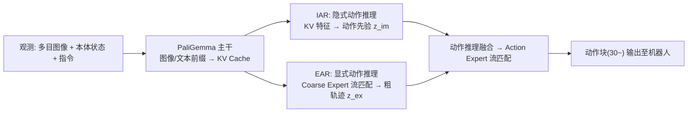

# ACoT-VLA 文档站

**ACoT-VLA: Action Chain-of-Thought for Vision-Language-Action Models**（[arXiv 2601.11404](https://arxiv.org/abs/2601.11404v2)）——官方实现的**使用说明与实现细节**文档。

本站在信息架构与表达方式上对标 DeepWiki(openpi) 风格：总览页 + 模块深潜页 + 术语/FAQ 附录，所有概念配 Mermaid 图，细节可追溯到真实源码。

::: tip 当前进度：P0 脚手架
页面骨架已就位，各页正文将按路线图在后续阶段(P1~P5)逐页填充；其中**架构总览页已内置完整 Mermaid 主架构图**，可先验证渲染效果。
:::

## 快速开始（文档站本身）

```bash
cd docs-site
npm install
npm run dev        # 本地预览 http://localhost:5173
npm run build      # 产物在 docs/.vitepress/dist/
```

## 一图流：ACoT-VLA 是什么



## 站点导航

| 模块 | 页面 |
|---|---|
| 入门 | [总览 Overview](/overview) · [快速上手 Quickstart](/quickstart) |
| 实现细节 | [架构总览](/architecture) · [数据管线](/data) · [模型深潜](/model-acot) · [训练系统](/training) · [配置中心](/config-center) |
| 使用与部署 | [推理与服务](/inference) · [评测与竞赛](/evaluation) · [真机部署](/deploy-real) |
| 附录 | [目录树/术语表/FAQ](/appendix) |

## 相关链接

- GitHub 仓库：[AgibotTech/ACoT-VLA](https://github.com/AgibotTech/ACoT-VLA)
- 论文：[arXiv 2601.11404](https://arxiv.org/abs/2601.11404v2) ｜ [HuggingFace Papers](https://huggingface.co/papers/2601.11404)
- 竞赛：[AgiBot World Challenge @ ICRA 2026 (Reasoning to Action)](https://agibot-world.com/challenge2026)