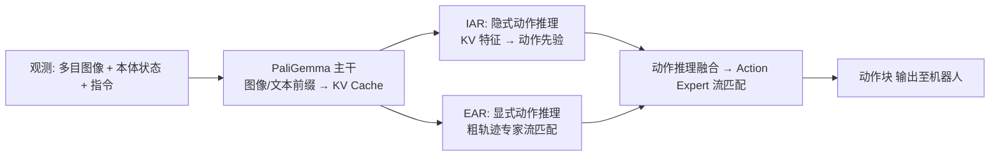

# ACoT-VLA 文档站

**ACoT-VLA: Action Chain-of-Thought for Vision-Language-Action Models**（[arXiv 2601.11404](https://arxiv.org/abs/2601.11404v2)）——官方实现的**使用说明与实现细节**文档。

本站在信息架构与表达方式上对标 DeepWiki(openpi) 风格：总览页 + 模块深潜页 + 术语/FAQ 附录，所有概念配 Mermaid 图，细节可追溯到真实源码（`文件:行号` 由脚本自动校验）。内容核验于源码基线 `cb9d195`。

## 一图流：ACoT-VLA 是什么



完整五层系统架构图（数据/管线/模型/训练/推理部署）见 [架构总览](/architecture)。

## 站点导航

| 模块 | 页面与内容 |
|---|---|
| 入门 | [总览 Overview](/overview)——定位、三大组件、成绩速览<br/>[快速上手 Quickstart](/quickstart)——安装→数据→训练→服务→验证全命令 |
| 实现细节 | [架构总览](/architecture)——主架构图与分层导读<br/>[数据管线](/data)——LeRobot/RLDS、转换、norm stats、transforms<br/>[模型深潜](/model-acot)——EAR/IAR/融合/损失/采样<br/>[训练系统](/training)——训练步、检查点、权重合并、LoRA<br/>[配置中心](/config-center)——25 个命名配置与新增数据集指南 |
| 使用与部署 | [推理与服务](/inference)——sample_actions、策略服务与客户端<br/>[评测与竞赛](/evaluation)——LIBERO/Plus/VLABench 与 ICRA 2026<br/>[真机部署](/deploy-real)——ALOHA/DROID/UR5/go1/AgileX |
| 附录 | [附录](/appendix)——术语表、FAQ、与 OpenPI 差异对照 |

自动生成快照（勿手改，随仓库更新）：[目录树](/generated/repo-tree) · [模块地图（类/函数→行号）](/generated/module-map) · [配置注册表](/generated/config-registry)

## 文档站本身

```bash
cd docs-site
npm install
npm run dev          # 本地预览 http://localhost:5173
npm run build        # 产物在 docs/.vitepress/dist/
```

质量护栏（CI 同样执行）：`node tools/check_mermaid.mjs`（mermaid 语法）、`node tools/check_links.mjs`（内部链接）、`py tools/check_anchors.py`（`文件:行号` 锚点真实性）；快照页由 `python tools/scan_repo.py` / `module_map.py` / `config_registry.py` 生成。

## 相关链接

- GitHub 仓库：[AgibotTech/ACoT-VLA](https://github.com/AgibotTech/ACoT-VLA)
- 论文：[arXiv 2601.11404](https://arxiv.org/abs/2601.11404v2) ｜ [HuggingFace Papers](https://huggingface.co/papers/2601.11404)
- 竞赛：[AgiBot World Challenge @ ICRA 2026 (Reasoning to Action)](https://agibot-world.com/challenge2026)
