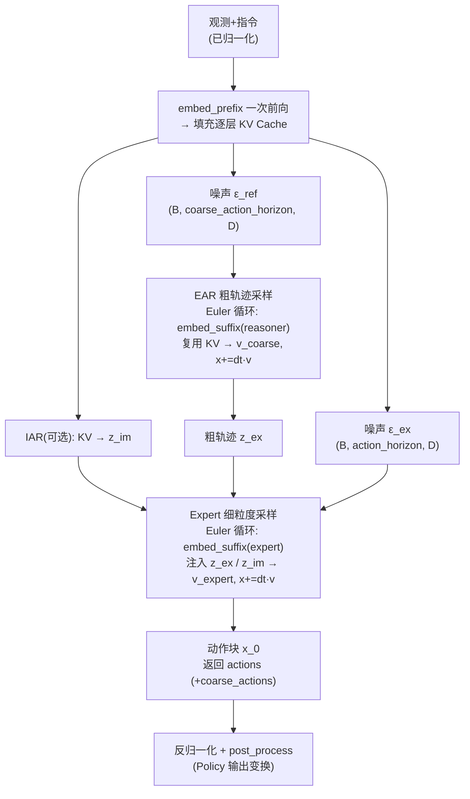
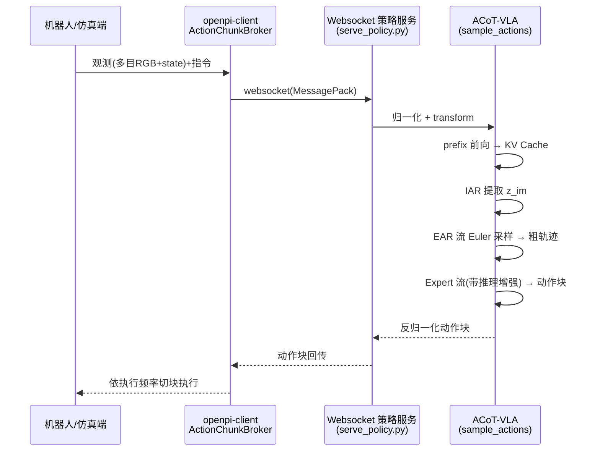

# 推理与服务 Inference

> 核验于源码基线 commit cb9d195。

本文回答「策略模型如何变成可调用的服务」：`sample_actions` 采样 → `Policy` 包装 → `WebsocketPolicyServer` 常驻 → 轻量 `openpi-client` 客户端。面向要起服务、写客户端、做录制与远程部署的人，所有论断锚定 `路径:行号`；分层总览见 [/architecture](/architecture)。

## 1. 从模型到策略：Policy 包装

`sample_actions` 只接受结构化 `Observation`（models/model.py:95-147）；`Policy`（policies/policy.py:23）把它包装成统一策略接口 `BasePolicy`——一个 `infer(obs)->dict`（base_policy.py:5-12），服务端、客户端、录制器都只面对它。

`Policy.infer` 顺序（policies/policy.py:42-70）：拷贝输入并施加输入变换（repack/归一化/prompt 注入，policies/policy.py:45）；加 batch 维（47）；拆 RNG 后调用已 jit 的 `sample_actions`（34、50-54）；去 batch 转 NumPy、施加输出变换（反归一化）并记 `policy_timing.infer_ms`（63-69）；`post_process` 按 `task_name` 裁剪动作或冻结腰关节（72-90）。`sample_kwargs` 默认空（38），采样步数走签名默认值。

服务端归一化与训练同源：`create_trained_policy` 从 checkpoint 的 `assets/` 加载 norm stats（policies/policy_config.py:44-49），输入侧 `Normalize`（57）、输出侧 `Unnormalize`（62）。**反归一化在服务端返回前完成**，客户端拿到真实动作空间。策略元数据 = `train_config.policy_metadata`（policies/policy_config.py:67；属性见 policies/policy.py:92-94），随连接握手推送（§4）。

## 2. sample_actions 两阶段采样

先由 **EAR 专家**从噪声解出粗轨迹，再由 **Action Expert** 带着粗轨迹与可选的 **IAR** 结果解出动作块：



`sample_actions`（models/acot_vla.py:795-901）关键事实：

- **步数与时间**：`num_steps` 默认 10（800），`dt = -1.0/num_steps`（805），Euler 更新 `x + dt·v`；t=1 噪声、t=0 目标（803-804 注释，与 pi0 相反）。两循环均 `jax.lax.while_loop`、条件 `time >= -dt/2`，从 t=1.0 走满 `num_steps` 步（853-858、892-896）。
- **双窗口**：噪声形状 `(batch, coarse_action_horizon, action_dim)` 与 `(batch, action_horizon, action_dim)`（809-810）；长度默认 50/30（`ACOTConfig`，275-276），由配置决定：LIBERO 15/10（training/config.py:1586）、ICRA G2SIM 30/30（training/config.py:1818-1821）。
- **prefix 只前向一次**填充全层 KV cache（813-816），EAR 与 Expert 每步复用（846、886）；IAR 开启时先由 KV 提取 `implicit_action_reason`（818-824）。
- **EAR 粗路**：每步把噪声动作作 reasoner suffix 前向，`coarse_action_out_proj` 得 v_t（826-851）；未启用 EAR 则整条跳过（857-860）。
- **Expert 细路**：同构步进，`embed_suffix(suf_type="expert")` 注入粗轨迹与 IAR 结果（863-870），`action_out_proj` 得 v_t（889-890）。
- **返回**：EAR 开启时 `{"actions", "coarse_actions"}`，否则仅 `actions`（898-901）。

与训练的关系：训练按 shift(2,1) 切粗/细窗口做两段流匹配回归（training/config.py:1591；窗口机制见 [/data](/data)），推理则从噪声**完整解码**等长轨迹与动作块；EAR/IAR 结构见 [/model-acot](/model-acot)。

## 3. 策略服务器

`scripts/serve_policy.py` 用 tyro 生成 CLI（scripts/serve_policy.py:135-137）。参数（scripts/serve_policy.py:41-58）：

| 参数 | 默认 | 含义 |
|---|---|---|
| `--env` | `ALOHA_SIM`（46） | 目标环境；默认策略时据此选 checkpoint |
| `--port` | `8000`（53） | 监听端口 |
| `--default-prompt` | `None`（50） | 观测缺 prompt 时兜底注入 |
| `--record` | `False`（55） | 录制策略行为（§7） |
| `--policy` | `Default`（58） | `Default` 或 `Checkpoint(config, dir)` |

`create_policy` 模式匹配两种加载（scripts/serve_policy.py:103-111）。`Default` 按 env 查 `DEFAULT_CHECKPOINT`（62-91）：LIBERO → `acot_libero_action_cot_explicit_implicit_co_fusion` @ `./checkpoints/.../40000`（75-78），LIBEROPLUS/VLABENCH/G2SIM 各 `/100000`、`/60000`、`/30000`（79-90），ALOHA/DROID 仍为上游 pi0（`gs://`，63-74）。`Checkpoint` 显式给 config 与 checkpoint 目录（本地或 `gs://`，policies/policy_config.py:38）。`main`（114-132）：`--record` 用 `PolicyRecorder(policy, "policy_records")` 包装（119-120），以 `0.0.0.0:port` 起服务并 `serve_forever()`（126-132）。

```bash
# 方式一：default 策略（env 决定 checkpoint）
uv run scripts/serve_policy.py --env LIBERO

# 方式二：显式 checkpoint（自己训练的产物）
uv run scripts/serve_policy.py --env LIBERO policy:checkpoint \
  --policy.config acot_libero_action_cot_explicit_implicit_co_fusion \
  --policy.dir ./checkpoints/<CONFIG>/<EXP_NAME>/<step>
```

一键脚本 `scripts/server.sh` 固定服务 ICRA G2SIM（scripts/server.sh:12），前设 `CUDA_VISIBLE_DEVICES`、XLA 显存等环境（1-9）。⚠️ 服务端推理依赖 NVIDIA GPU（`jax[cuda12]`，pyproject.toml:18），不能纯 CPU 起服务。

## 4. 通信协议与服务器实现

一次完整推理的时序（与 [/quickstart](/quickstart) 最小闭环对应）：



逐步对应代码：观测键由环境约定（LIBERO 示例见 examples/simple_client/main.py:176-182），图像建议客户端先 resize 224/uint8 再传（docs/remote_inference.md:45-47）；`C->>S` 走 msgpack（§5）；「归一化 + transform」在 `Policy.infer` 输入变换（repack/`Normalize`，policies/policy_config.py:53-59），state 可非归一化直传（docs/remote_inference.md:48）；`prefix→KV / IAR / EAR / Expert` 即 §2 各步（models/acot_vla.py:813-816 起）；反归一化在输出变换 `Unnormalize`（policies/policy_config.py:60-64），回传块 `(action_horizon, action_dim)`（docs/remote_inference.md:61）；按频切块见 §5（action_chunk_broker.py:26-44）。

服务器事实（serving/websocket_policy_server.py）：`WebsocketPolicyServer`（15）基于 `websockets.asyncio.server.serve`，`compression=None`、`max_size=None`（37-46）；**`GET /healthz` 返回 200 OK**（86-90）。连接建立先推送 metadata（52），再循环 `recv → infer → 回填 server_timing.infer_ms/prev_total_ms → send`（57-72）。无排队/批处理：`policy.infer` 同步调用（61），推理期间事件循环被占用，多连接实际串行。客户端断开正常收尾（74-76）；推理异常回发 traceback 字符串并以 `INTERNAL_ERROR` 关闭（77-83），客户端遇字符串响应抛 `RuntimeError`（websocket_client_policy.py:48-50）。

## 5. openpi-client

`WebsocketClientPolicy`（websocket_client_policy.py:12-55）：`infer` = pack→send→recv→unpack（44-51）；URI `ws://host[:port]`（19-21），可带 `api_key` 头（33）。连接未建立时阻塞重试，`ConnectionRefusedError` 每 5 秒一次（29-41），首帧即服务端 metadata（37）。

`ActionChunkBroker`（action_chunk_broker.py:10-50）定义**切块/执行频率**：动作字段第一维即块长（13）；每次 `infer` 只返回第 `cur_step` 行（32-39），块消费完（`>= action_horizon`）才清缓存、触发下次底层推理（41-42）。即控制周期级调用，模型每 `action_horizon` 步推理一次；`reset()` 清缓存（46-50）。

`msgpack_numpy`（msgpack_numpy.py）给 msgpack 加数组支持：`ndarray` 编码为 `{__ndarray__, data/dtype/shape}`（25-31），`Packer`/`unpackb`（53-57）；选型理由见文件头：安全、跨语言、免 schema、快（1-13）。`runtime/` 编排闭环：`Agent`/`PolicyAgent`（runtime/agent.py:4-17、runtime/agents/policy_agent.py:7-18）、`Environment`（runtime/environment.py:4-32）、`Subscriber`（runtime/subscriber.py:4-20）、`Runtime` 循环 `get_observation → get_action → apply_action → 通知`，支持 `max_hz` 限频与 episode 约束（runtime/runtime.py:10-92）。

## 6. 最小用例

`examples/simple_client` 提供最小连通用例（examples/simple_client/README.md:22-29）：

```bash
# 终端 1：起策略服务（换 LIBERO/G2SIM 即可）
uv run scripts/serve_policy.py --env LIBERO

# 终端 2：随机观测客户端
uv run examples/simple_client/main.py --env LIBERO
```

客户端行为（examples/simple_client/main.py:117-150）：默认连 `0.0.0.0:8000`（31-33）→ 打印服务端 metadata（130）→ 预热 2 次（133-134）→ 循环 `num_steps`（默认 20，37）次 `infer`，记录往返与 `server_timing.*`、`policy_timing.*`（138-145）→ 输出统计表、可选 `--timing-file`（70-107、149-150）。观测为随机样例（153-182），只验连通与吞吐，不代表成功率——真评测见 [/evaluation](/evaluation)。

嵌入自己的代码（docs/remote_inference.md:35-68）：

```python
from openpi_client import websocket_client_policy

client = websocket_client_policy.WebsocketClientPolicy(host="localhost", port=8000)
action_chunk = client.infer(observation)["actions"]  # (action_horizon, action_dim)
# 通常每 N 步调用一次，其余步按块内动作开环执行
```

## 7. 录制与回放

`PolicyRecorder`（policies/policy.py:97-119）透明包装策略：每次 `infer` 把 `{"inputs", "outputs"}` 展平存为 `step_{N}.npy`（108-118）。`serve_policy.py --record` 即自动包装，目录 `policy_records`（scripts/serve_policy.py:119-120）。`examples/policy_records.ipynb` 扫描 `../policy_records/step_*.npy` 还原逐条记录，可查每步输入图像与输入/输出曲线；推理计时示例另见 `examples/inference.ipynb`。

## 8. 远程/多机部署

动机：把策略放机器人之外的 GPU 上，机器人侧只留轻量客户端，并隔离两边的依赖环境（docs/remote_inference.md:4）。服务端 `uv run scripts/serve_policy.py --env [DROID | ALOHA | LIBERO]`（8-13）；机器人侧 `cd packages/openpi-client && pip install -e .` 后仅依赖 `openpi_client`（28-31）。要点：图像客户端先 resize 224 转 uint8、state 非归一化直传（45-48）。容器与真机多机拓扑见 [/deploy-real](/deploy-real)；硬件要求同 §3。

## FAQ

1. **没有 GPU 能跑推理吗？** —— 不能。服务端要加载 bfloat16 JAX 模型采样，依赖 `jax[cuda12]`（pyproject.toml:18）；客户端侧只需 CPU 的 `openpi-client`（§5-6）。可用他机 GPU 远程部署（§8）。
2. **一次请求是 batch 的吗？执行频率谁决定？** —— 单条观测/请求，`Policy.infer` 内部临时 batch=1（policies/policy.py:47）；服务端无批处理，多请求串行（serving/websocket_policy_server.py:61）。执行频率在客户端：开环每 N 步调一次（docs/remote_inference.md:61-63），或 `ActionChunkBroker` 逐动作切块（action_chunk_broker.py:41-42）。
3. **服务端出错会怎样？自动重连吗？** —— 异常回发 traceback 并关闭（serving/websocket_policy_server.py:77-83），客户端抛 `RuntimeError`（websocket_client_policy.py:48-50）；连上前的重试每 5 秒一次（39-41），**已建立连接中断不自动重连**。探针 `GET /healthz`（86-90）；时延看 `policy_timing.infer_ms`（policies/policy.py:67-69）与 `server_timing.*`（serving/websocket_policy_server.py:64-69）。
4. **返回里还有什么？** —— EAR 配置返回 `{"actions", "coarse_actions"}`（models/acot_vla.py:898-901）：`actions` 为已反归一化的动作块，`coarse_actions` 为同批次粗轨迹（调试/可视化）。
5. **采样步数能调吗？** —— `num_steps` 默认 10、`dt=-1/num_steps`（models/acot_vla.py:800、805）；加载时经 `create_trained_policy(sample_kwargs=...)` 注入（policies/policy_config.py:20、66），serve_policy.py 的 CLI 不直接暴露。步数多则慢、块通常更平滑（经验性权衡）。

## 相关页面

- 端到端闭环与总览：[快速上手 /quickstart](/quickstart) · [架构总览 /architecture](/architecture)
- 机制细节：[数据管线 /data](/data) · [模型深潜 /model-acot](/model-acot) · [训练系统 /training](/training) · [配置中心 /config-center](/config-center)
- 部署与评测：[评测与竞赛 /evaluation](/evaluation) · [真机部署 /deploy-real](/deploy-real)
