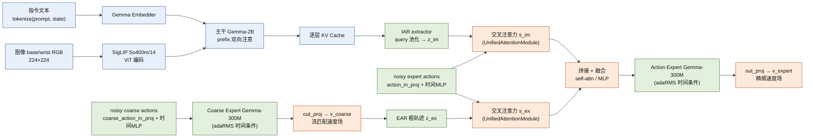

# 模型深潜 Model (EAR/IAR)

> 核验于源码基线 commit cb9d195 · 论文符号与代码变量的对应见文末对照表。

本页面向研究者，逐层拆解 ACoT-VLA（源码 `src/openpi/models/acot_vla.py`）：PaliGemma 主干与逐层 KV Cache、IAR 三种 extractor、EAR 粗轨迹流匹配、双路推理融合（`embed_suffix`）、两段损失与两阶段采样。每个论断锚定 `路径:行号`；论文符号与代码变量名的对应见文末对照表。配套：[架构总览](/architecture) · [数据管线](/data) · [训练系统](/training) · [配置中心](/config-center)。

> 图：模型内部结构（图像/文本 → 主干 → 逐层 KV → IAR/EAR → 交叉注意力 → 融合 → Action Expert）。EAR=显式动作推理（合成粗粒度动作轨迹提供直接运动线索）；IAR=隐式动作推理（从 VLM 主干内部表征提取隐式动作先验）；ACoT=二者结合后的推理范式。

## 0. 模型总览

ACoT-VLA 是一条**"主干 + 双动作专家"三段式**流水线，全部位于 `src/openpi/models/acot_vla.py:376` 的 `ACOT_VLA` 类：

1. **PaliGemma 主干**：SigLIP So400m/14 图像编码器 + Gemma-2B LLM，只处理"前缀"（图像 + 指令文本），产出**逐层 KV Cache**（`embed_prefix`，`acot_vla.py:516-548`）。
2. **两路动作推理**：IAR 用 extractor 把主干 KV 逐层压成 `z_im`；EAR 用粗轨迹专家（llm 第二权重组）在粗时间域做流匹配得到 `z_ex`。
3. **Action Expert 精细头**：把加噪精细动作 token 与 `s_ex`/`s_im` 融合后送入动作专家（llm 第三权重组），回归精细速度场 `v_expert`。

**与 pi0 的关系**：`ACOTConfig` 继承 `_model.BaseModelConfig`（`model.py:222`），是 `Pi0Config`（`pi0.py:68`）的超集——把 pi0 的"主干 + 单动作专家"双配置（`pi0.py:178`）扩为**三配置** `configs=[paligemma, coarse_action_expert, action_expert]`（`acot_vla.py:385-391`），同装一个 `_gemma.Module`（同深 18 层、同一次前向自注意力，见 §2），各组权重独立。`pi05` 语义与 pi0 一致（`pi0.py:77-80` 注释）：pi0 形态把 state 作连续 token 拼进后缀、时间步经 MLP 与动作 token 拼接；pi05 形态把 state 离散化为语言 token 进前缀、动作专家改用 adaRMS 注入时间步（`pi05` 细节见 FAQ Q1）。

`model_type` 按 `pi05` 返回 `ACOT_VLA_PI05`/`ACOT_VLA_PI0`（`model.py:47-48`；`acot_vla.py:295-301`），数据侧 `ModelTransformFactory` 据此分发离散状态注入（`training/config.py:146-170`）；仓库 8+ 个 ACoT 命名配置全部 `pi05=True`（见 [config-registry](/generated/config-registry)）。

## 1. ACOTConfig 字段全解

`ACOTConfig` 定义于 `src/openpi/models/acot_vla.py:266-331`，`get_freeze_filter` 紧随其后（333 行）。`inputs_spec`（`acot_vla.py:308-330`）约定观察侧：3 路 224×224 图像（base + 左右腕，`IMAGE_KEYS` 见 `model.py:51-55`）、`state=(batch, action_dim)`、`tokenized_prompt=(batch, max_token_len)` int。

| 字段 | 默认值 | 含义（代码锚点） |
|---|---|---|
| `dtype` | `"bfloat16"` | 主干/专家 embed 与激活精度（`acot_vla.py:268`；`gemma.py:433`） |
| `paligemma_variant` | `"gemma_2b"` | 主干权重组变体（`acot_vla.py:269`） |
| `coarse_action_expert_variant` | `"gemma_300m"` | 粗轨迹专家（llm 第 2 组）变体（`acot_vla.py:270`） |
| `action_expert_variant` | `"gemma_300m"` | 精细动作专家（llm 第 3 组）变体（`acot_vla.py:271`） |
| `action_dim` | `32` | 动作维度，同时是 state 维度（`acot_vla.py:274,324`） |
| `coarse_action_horizon` | `50` | 粗轨迹时间长度 H_c（`acot_vla.py:275`） |
| `action_horizon` | `30` | 精细动作块长度 H_a（`acot_vla.py:276`） |
| `max_token_len` | `None` | `__post_init__` 推导：`pi05=True` 取 200，否则 48（`acot_vla.py:277,289-291`） |
| `pi05` | `True` | pi0/pi05 形态开关；决定 state 进文本、adaRMS 与 `model_type`（`acot_vla.py:278,295-301`） |
| `discrete_state_input` | `None` | 默认随 `pi05`（`acot_vla.py:280,292-293`）；数据侧 `TokenizePrompt` 读取（`transforms.py:299,305-309`） |
| `adopt_explicit_action_reasoner` | `False` | 是否启用 EAR（显式推理）分支（`acot_vla.py:282`） |
| `adopt_implicit_action_reasoner` | `False` | 是否启用 IAR（隐式推理）分支（`acot_vla.py:283`） |
| `query_based_implicit_extractor` | `False` | IAR 用可学习 query extractor（`acot_vla.py:285`） |
| `attention_pooling_implicit_extractor` | `False` | IAR 用注意力池化 extractor（`acot_vla.py:286`） |
| `downsample_based_implicit_extractor` | `False` | IAR 用下采样 extractor（`acot_vla.py:287`） |

`__post_init__` 只推导 `max_token_len` 与 `discrete_state_input` 缺省（`acot_vla.py:289-293`），**不校验 extractor 组合**——运行时开了 IAR 却未选任何 extractor 会直接 `ValueError`（`acot_vla.py:473-474`）。命名配置一律用 downsample extractor（例 `training/config.py:1586,1613,1651,1821`）。

## 2. PaliGemma 主干

**图像编码**：`ACOT_VLA` 组装 `img = _siglip.Module(num_classes=paligemma_config.width, variant="So400m/14", pool_type="none", scan=True, dtype_mm=config.dtype)`（`acot_vla.py:393-402`）。`decode_variant`（`siglip.py:298-373`）给出 So400m 几何：patch 14×14、depth 27、width 1152、16 heads、mlp 4304；stem 卷积以 stride=patch 切块（`siglip.py:216-223`），`pool_type="none"` 表示**不加池化/CLS**（`siglip.py:266-267`），随后 `num_classes` 线性头（`siglip.py:284-288`）把每个 patch token 映射到主干宽度 2048——224×224 输入得到 16×16=256 个 2048 维图像 token，`embed_prefix` 逐相机调用 `img`（`acot_vla.py:523-535`）。

**Gemma-2B 主干与多配置共享**：`gemma_2b` 配置 = width 2048 / depth 18 / 8 heads / 1 kv head / head_dim 256 / mlp 16384（`gemma.py:126-134`）。`_gemma.Module(configs=[...])` 用 `nn.scan` 按公共深度 18 扫掠 `Block`（断言各 config 深度一致，`gemma.py:397-399,406-428`）；每个 `Attention` 里各组并行算 Q/K/V 后**拼接做一次联合自注意力**（`gemma.py:219-248`），输出按组切回（`gemma.py:280-295`）。einsum 按组命名：第 0 组无后缀（可无缝读 PaliGemma 权重）、其后 `_1`/`_2`（`gemma.py:490-497`）；RoPE 见 `gemma.py:471-487`。文本侧 `tokenized_prompt` 在 `embed_prefix` 内经 `llm(..., method="embed")`（`acot_vla.py:539`）走 gemma embedder（仅第 0 组持有，`gemma.py:401-405,432-433`；词表 257,152，`gemma.py:41`），pi05 指令含离散化 state（`tokenizer.py:20-25`），pi0 形态则只有指令 + 换行符（`tokenizer.py:26-29`）。

**逐层 KV Cache**：prefix 前向 `self.PaliGemma.llm([prefix_tokens, None, None], ...)`（训练 `acot_vla.py:726`；推理 `acot_vla.py:816`）返回各层 (K,V) 堆叠的 `KVCache: "l b _t _k _h"`（`gemma.py:383`）；每层只存 1 个 kv 头（各配置 `num_kv_heads=1`，`gemma.py:213-215` 强制一致）。该缓存是 §3 IAR 的输入，也是推理两路 Euler 采样全程复用的对象（`acot_vla.py:842-848,882-888`）。

## 3. IAR：三种 extractor 与主干 KV 衔接

IAR 的输入输出契约由三个 extractor 的 `__call__` 统一：`K, V: (B, L, T, D) → (B, L, output_dim)`（`acot_vla.py:78-82,133-134,202-206`）。衔接处把 prefix 缓存从 `'L B T 1 D'` 重排为 `'B L T D'` 再喂入（`acot_vla.py:750-754`），即 **L=18 层、T=prefix token 数、D=head_dim=256**（每层 1 个 kv 头）。输出 `z_im` 形状 `(B, L, action_expert_width)`——**每主干层压缩出一个向量**——随后作为交叉注意力的 KV（§5）。三种 extractor 与开关一一对应（`acot_vla.py:439-474`）：

| | LearnableQueryExtractor（`acot_vla.py:35-102`） | AttentionPoolingExtractor（`acot_vla.py:105-153`） | DownsampleExtractor（`acot_vla.py:156-239`） |
|---|---|---|---|
| 开关 | `query_based_implicit_extractor` | `attention_pooling_implicit_extractor` | `downsample_based_implicit_extractor` |
| 实例化 | `acot_vla.py:442-451` | `acot_vla.py:453-461` | `acot_vla.py:463-472` |
| Query 来源 | **逐层独立可学习 query**（`num_queries=8`） | 取该层 K 的**均值**作 query（`acot_vla.py:139`） | **单条可学习 query**（`num_queries=1`） |
| 投影 | 各层 query 先线性进 `heads×head_dim`，与 K/V 做点积注意力，再按 query 维平均（`acot_vla.py:89-99`） | 同左，但无 query 维平均（`acot_vla.py:141-150`） | 先投影到**下采样维** `downsample_dim=head_dim/2=128`（实例化处 469 行），在低维空间做注意力（`acot_vla.py:216-236`） |
| 层间共享 | `group_size=3`：每 3 层共享一组 q/k/v/out 投影（`acot_vla.py:53,86`） | 同左（`acot_vla.py:113,137`） | 同左（`acot_vla.py:174,211`） |
| 输出 | 每层一个 `output_dim=action_expert_width` 向量，沿层维堆叠 → `(B, L, width)` | 同左 | 同左 |

实例化公共参数：`dim=head_dim`、`heads=paligemma num_heads`、`output_dim=action_expert_config.width`（`acot_vla.py:444-450,454-460,465-470`）。开关同开时按 if/elif 只取第一个（`acot_vla.py:441-472`）；当前命名配置只开 downsample。IAR 只对**一次 prefix 前向**执行（`acot_vla.py:754,822`），不随 Euler 步重复。

## 4. EAR：显式粗轨迹推理

EAR 在代码里体现为两条：**粗轨迹专家**（llm 第二权重组，`suf_type="reasoner"`）负责产出粗粒度轨迹；`self.explicit_action_reasoner`（`acot_vla.py:424-432`）负责把粗轨迹变成精细动作的显式条件（§5）。

- **训练**：粗路是 **teacher-forcing**——`explicit_action_reason = coarse_actions`（真值，`acot_vla.py:743-744`），对加噪粗动作 `x_ref_t` 回归粗速度场（§7）。粗路 suffix 与 fine 路同构，只是投影换用 `coarse_action_in_proj`（`action_dim → coarse width`，`acot_vla.py:404`）与 `coarse_action_out_proj`（`acot_vla.py:419`）。
- **推理**：粗轨迹由**独立 Euler 循环**从高斯噪声生成（`acot_vla.py:826-860`）：每步把当前 `x_t` 拼进 `suf_type="reasoner"` 后缀、复用 prefix 缓存前向 llm 第 2 分支，投影 `v_t = coarse_action_out_proj(...)`（849 行）后 `x ← x + dt·v_t`（851 行）。

EAR 关闭时训练不回粗路损失（§7），推理跳过粗轨迹循环、`explicit_action_reason = None`（`acot_vla.py:857-860`）。

## 5. 推理融合：s_ex / s_im 增强动作 token

融合发生在 `embed_suffix(..., suf_type="expert")` 分支内（`acot_vla.py:598-671`），按开关组合分档：

- **EAR 条件（s_ex）**：粗轨迹 `explicit_action_reason`（B×H_c×action_dim）先经 `coarse_action_in_proj` 编码成 token——代码注释明确此为论文的 `z^{ex}`（`acot_vla.py:621-622`）；再以精细动作 token 为 Q、`z_ex` 为 KV 过 `self.explicit_action_reasoner(...)`（`acot_vla.py:624-627`），交叉注意力输出即 `s^{ex}`（注释 623 行）。`explicit_action_reasoner` 是 `UnifiedAttentionModule(in_dim_1=action width, in_dim_2=coarse width, out_dim=action width, hidden_dim=action width, num_heads=4, apply_sigmoid=False)`（`acot_vla.py:424-432`）。
- **IAR 条件（s_im）**：extractor 输出 `z_im` 直接作 token（注释 629-630 行）过 `implicit_action_reasoner_interact(...)`（`acot_vla.py:632-635`）——以动作 token 为 Q、`z_im`(B×L×width) 为 KV，得 `s^{im}`；该模块同为 `UnifiedAttentionModule`（`acot_vla.py:475-483`）。
- **双路融合（co_fusion）**：EAR+IAR 同开时，两路各自"动作 token 拼接"后经 `explicit/implicit_action_reason_proj`（2×width→width，`acot_vla.py:637-642`），再把两条结果**拼接并用自注意力融合** `action_reasoning_fusion(feat, feat)`（`acot_vla.py:644-646`），其为 `UnifiedAttentionModule(in_dim_1=in_dim_2=2*width)`（`acot_vla.py:485-496`）。
- **单路**：只开一路退化为"拼接 + `MLP(2×width→width)` 融合"（无激活，`acot_vla.py:498-505,649-667`；`MLP` 定义 22-33）；全关则保持 vanilla 透传动作 token（`acot_vla.py:669-671`）。

`UnifiedAttentionModule` 本体（`acot_vla.py:242-263`）：`feat_1` 经 `q_proj` 得 Q，`feat_2` 经 `kv_proj` 拆出 K/V（`jnp.split`，255 行），做 4 头 `MultiHeadAttention`（`decode` 透传给增量解码路径），再接 `fc_out`；`apply_sigmoid=True` 时输出再过 sigmoid（261-263 行）。**当前仓库三处实例化均传 `apply_sigmoid=False`**（`acot_vla.py:429,480,493`）；本文件采样循环按整段 suffix 重算，`decode` 均用默认 False。

## 6. 前向与注意力语义

**`embed_prefix`**（`acot_vla.py:515-548`）：把图像 token（524 行）与文本 token（539 行）沿序列拼接，返回 `tokens/input_mask/ar_mask`；prefix 内 `ar_mask` 全 False，图像与文本全双向（534-543 行注释）。

**`embed_suffix`**（`acot_vla.py:550-692`）按 `suf_type` 分叉：`"reasoner"`（576-596）与 `"expert"`（598-671）。两分支结构镜像 pi0 的 `embed_suffix`（`pi0.py:242-289`）：

- `pi05=True`：动作 token 与时间嵌入**分两路**——`posemb_sincos(timestep, width, min_period=4e-3, max_period=4.0)`（`acot_vla.py:578,600`；函数本体 `pi0.py:49-64`）经两层时间 MLP 变作 **adaRMS 条件**（`acot_vla.py:580-587,602-609`），逐 block 在 RMSNorm 里调制 scale/shift/gate（`gemma.py:160-178,350,365`）。
- `pi05=False`：时间嵌入重复到整条轨迹长度，与动作 token 拼接后经 `2×width→width` MLP（`acot_vla.py:588-596,610-618`）；并额外在**序列最前加一个连续 state token**（`state_proj`，`acot_vla.py:413,567-574`，同 pi0 形态 `pi0.py:254-260`）。

**因果掩码语义**（`make_attn_mask`，`pi0.py:20-45`）：`ar_mask=True` 处是"注意力屏障"——屏障**前**的 token 不能 attend 屏障及其后。prefix 全 False ⇒ prefix 内部双向；suffix 首 token True、其余 False（`acot_vla.py:680-683`）⇒ **prefix 不能 attend 动作块，动作块可 attend prefix 与块内全部**。`pi05=False` 时 state token 同作屏障（`acot_vla.py:573-574`）。

**训练前向**：prefix 只 embed 一次（`acot_vla.py:722`），但主干前向共三次——纯 prefix（726，仅为取缓存喂 IAR）、reasoner 路 `[prefix, coarse_suffix, None]`（737-742）、expert 路 `[prefix, None, expert_suffix]`（771-776）；后两次各自按 prefix+suffix 全长构建掩码，无跨步 KV 复用。

**推理前向**：prefix 前向一次并保留 `kv_cache`（`acot_vla.py:813-816`）；每步只跑对应专家分支 `[None, suffix_tokens, None]` 或 `[None, None, suffix_tokens]`，掩码拼成 `(batch, suffix_len, prefix_len+suffix_len)`（`acot_vla.py:832-840,872-880`），suffix 位置自 `sum(prefix_mask)+cumsum(suffix_mask)-1` 起算（840/880 行）——prefix 的 K/V 全程复用，仅 suffix K/V 每步重算并临时追加进缓存。

## 7. 损失与采样

**`compute_loss`**（`acot_vla.py:695-792`）接收多出的 `coarse_actions` 参数（类型别名 `model.py:152`）。核心步骤与代码变量逐一对应：

| 步骤 | 代码（行号） |
|---|---|
| 粗细两路独立高斯噪声 | `coarse_action_noise` / `expert_action_noise`（708-709） |
| 扩散时间采样 | `time = jax.random.beta(time_rng, 1.5, 1, batch_shape) * 0.999 + 0.001`（711） |
| 加噪插值（t=1 噪声 → t=0 真值） | `x_ref_t = t·coarse_action_noise + (1−t)·coarse_actions`；`x_expert_t = t·expert_action_noise + (1−t)·actions`（715,718） |
| 流匹配速度目标 | `u_ref_t = coarse_action_noise − coarse_actions`；`u_expert_t = expert_action_noise − actions`（716,719） |
| 模型预测速度 | `v_ref_t = coarse_action_out_proj(suffix_ref_action_out[:, −coarse_action_horizon:])`（781）；`v_expert_t = action_out_proj(suffix_expert_out[:, −action_horizon:])`（782/790） |
| 两段流匹配损失 | `mean((u_ref_t − v_ref_t)²) + mean((u_expert_t − v_expert_t)²)`（784-787；代码注释说明两路各占 0.5） |
| 未开 EAR 时 | 只回 expert 路：`mean((u_expert_t − v_expert_t)²)`（789-792） |

**`sample_actions`**（`acot_vla.py:795-901`）按"先粗后细"两阶段 Euler 采样：时间约定 `dt = −1.0 / num_steps`（默认 `num_steps=10`），从 t=1（噪声）推进到 t=0，循环条件 `time >= -dt/2`（803-805,853-855,892-894）。第一阶段跑粗轨迹循环（826-860）得到 `explicit_action_reason`；第二阶段在**每一步**把该粗轨迹（以及 IAR 提取的 `z_im`，818-824 提前算好）传入 `embed_suffix(..., suf_type="expert")` 做专家条件化（865-870），Euler 更新 `x ← x + dt·v_t`（889-890）。返回 `{"actions": x_0_expert, "coarse_actions": ...}`（898-901）——粗轨迹随动作块一并回传（窗口语义见 [数据管线](/data)；配置侧 `joint_action_shifts` 注释见 `training/config.py:1910-1914`）。

## 8. 冻结与 LoRA

`get_freeze_filter`（`acot_vla.py:333-373`）默认参数：`freeze_llm=False`、`freeze_llm_embedder=True`、`freeze_vision=False`、`freeze_dual_ae=[False, False]`（分别冻结主干、embedder、SigLIP `img` 路径、粗/细专家）。路径规则依赖命名后缀：主干 = `llm` 且**不含** `_1/_2`（`acot_vla.py:335`，负向先行断言），粗专家含 `llm..._1`（336）、细专家含 `llm..._2`（337），与 gemma 组命名（`gemma.py:490-497`）一致；全不冻结返回 `nnx.Nothing`（354-355）。**LoRA/embedder 保活**：任一变体含 `"lora"` 则 lora 参数永不冻结（360-362）；`freeze_llm_embedder=False` 则 embedder 解冻（364-365）；最终 filter 为 `All(冻结集, Not(保活集))`（370-373）。

LoRA 在模型层按 config 附带：`gemma_2b_lora` 给 attn+ffn 各挂 `rank=16, alpha=16`（`gemma.py:135-144`），`gemma_300m_lora` 挂 `rank=32, alpha=32`（`gemma.py:145-155`）；`lora.Einsum`/`lora.FeedForward` 把增量并回主权重（缩放 `alpha/rank`，`lora.py:28-30,59-65,144-149`）。命名配置实例：LIBERO/VLABench/LIBERO-Plus/Go1 系列 `freeze_llm=True, freeze_vision=False, freeze_dual_ae=[False,False]`（`training/config.py:1608,1646,1673,1813`），ICRA 挑战赛 baseline 用 `gemma_2b_lora` 主干 + 同款冻结（`training/config.py:1821,1936-1938`）。权重加载侧：`ACOTCheckpointWeightLoader`（`training/weight_loaders.py:57-81`）把 pi05 检查点中动作专家侧的 `action_in_proj/action_out_proj/time_mlp_*` 重映射为粗专家侧（62-71 行），其余缺失参数按"去掉 `_N` 后缀克隆自 `_1`"或随机 ×0.02 补齐（`training/weight_loaders.py:139-158`），从而让双专家从 pi05 预训练冷启动。

## 9. 论文符号 ↔ 代码命名对照表

| 论文符号 | 代码对应（均以实际代码为准） | 锚点 |
|---|---|---|
| EAR（显式动作推理） | `self.explicit_action_reasoner`（UnifiedAttentionModule）+ 粗轨迹专家分支 | `src/openpi/models/acot_vla.py:424-432,576-596` |
| IAR（隐式动作推理） | `self.implicit_action_reasoner`（三种 extractor 之一）+ `implicit_action_reasoner_interact` | `src/openpi/models/acot_vla.py:441-483` |
| ACoT（推理范式） | 粗轨迹先验 + 隐式先验共同注入 expert 分支 | `src/openpi/models/acot_vla.py:620-671` |
| 粗轨迹（Coarse trajectory） | 训练 = `coarse_actions`（真值，teacher-forcing）；推理 = 粗路 Euler 采样结果 `explicit_action_reason` | `src/openpi/models/acot_vla.py:743-744,857-858` |
| z_ex | 注释明言：`explicit_action_reason` 经 `coarse_action_in_proj` 编码后的 token（`explicit_action_reason_tokens`） | `src/openpi/models/acot_vla.py:621-622` |
| s_ex | 注释明言：`explicit_action_reasoner` 交叉注意力输出（`aligned_explicit_action_reason_tokens`） | `src/openpi/models/acot_vla.py:623-627` |
| z_im | 注释明言：extractor 输出 `implicit_action_reason`（形状 `(B, L, width)`） | `src/openpi/models/acot_vla.py:629-630,750-754` |
| s_im | 注释明言：`implicit_action_reasoner_interact` 交叉注意力输出（`aligned_implicit_action_reason_tokens`） | `src/openpi/models/acot_vla.py:631-635` |
| 融合 / gating | `action_reasoning_fusion`（双路 self-attn / 单路 MLP） | `src/openpi/models/acot_vla.py:485-505,644-667` |
| 流匹配插值 x_t / 目标 u | `x_ref_t/x_expert_t`、`u_ref_t/u_expert_t`（u = 噪声 − 真值） | `src/openpi/models/acot_vla.py:715-719` |
| 速度场 v | `v_ref_t`、`v_expert_t`（out_proj 后取末尾 horizon 切片） | `src/openpi/models/acot_vla.py:781-782,790` |
| 扩散时间 t | `time ~ Beta(1.5,1)·0.999+0.001`；adaRMS 条件 `adarms_cond` | `src/openpi/models/acot_vla.py:711,587,609` |
| （对照）pi0 同构量 | `x_t/u_t/v_t`，见 pi0 实现 | `src/openpi/models/pi0.py:302-317` |

> 注：论文若出现本表未列符号，以代码为准——表中每个符号都给出代码内真实变量名与行号，论文写法可能略有出入。

## FAQ

**Q1：`pi05` 到底是什么开关？**
pi0/pi05 两条路线的切换键，两点差异见 `pi0.py:77-80` 注释：pi05 把 state 作离散语言 token（非连续后缀输入），动作专家用 adaRMS 注入时间步。ACoT 默认 `pi05=True`：state 经 tokenizer 离散化进文本（`tokenizer.py:20-25`）、双专家开 adaRMS（`acot_vla.py:392`）、`model_type=ACOT_VLA_PI05` 走数据侧离散状态注入路径（实际是否注入由 `discrete_state_input` 决定，`training/config.py:158-170`）；`False` 则回到 pi0 风格（连续 state token + 时间-动作拼接 MLP，`acot_vla.py:567-574,588-596`）。

**Q2：双专家与主干的参数是"共享"的吗？**
不共享权重、共享"骨架"。三者是同一 `_gemma.Module` 里的三份权重组（`acot_vla.py:385-391`），层数一致（`gemma.py:399`），每层把三组 token 拼在一起做联合自注意力（`gemma.py:248`），但 QKV/FFN 投影与 norm 各自独立（`gemma.py:219-246,280-295`）；embedder 只属第 0 组（`gemma.py:401-405`）。共享一份深度扫描层栈，且第 0 组无后缀命名可直接读 PaliGemma/pi05 权重（`gemma.py:490-497`）。

**Q3：为什么推理要先采粗轨迹（EAR）再采精细动作？**
因为精细专家依赖粗轨迹条件：`embed_suffix(..., suf_type="expert")` 中 `s_ex` 是把粗轨迹编码（z_ex）后交叉注意力得到的（`acot_vla.py:621-627`），故推理须先由粗路 Euler 循环（`acot_vla.py:826-860`）生成完整粗轨迹，再进 expert 循环（`acot_vla.py:863-896`）逐 Euler 步注入。训练则以真值 `coarse_actions` teacher-forcing 替代（`acot_vla.py:743-744`），两段损失可并行监督。

**Q4：三开关 extractor 同时为 True 会怎样？**
`ACOT_VLA.__init__` 按 `query_based → attention_pooling → downsample` 的 if/elif 只实例化第一个（`acot_vla.py:441-472`）；开了 IAR 却一个都没选会 `ValueError`（`acot_vla.py:473-474`）。当前命名配置均只开 downsample。

**Q5：模型一次前向要跑几次主干？**
训练（EAR+IAR 同开）每步三次：纯 prefix 取缓存喂 IAR（`acot_vla.py:726`）、粗路 `[prefix+coarse_suffix]`（737-742）、细路 `[prefix+expert_suffix]`（771-776）。推理则 prefix 只前向一次（`acot_vla.py:813-816`），粗/细 Euler 循环每步只跑对应专家分支并复用 prefix 缓存（`acot_vla.py:842-848,882-888`）。

## 相关页面

- [架构总览](/architecture)：五层系统与模块地图
- [数据管线](/data)：obs / actions / coarse_actions 三元组与粗细分窗
- [训练系统](/training)：两段流匹配损失的反向传播侧（`acot_train_step`）
- [配置中心](/config-center)：全部 ACoT 命名配置与冻结参数
- [推理与服务](/inference)：`sample_actions` 两阶段采样到策略服务的链路
- [附录](/appendix)：术语表与 OpenPI 差异对照
- 生成物：[模块地图](/generated/module-map)（`acot_vla.py` 全符号行号索引）、[配置注册表](/generated/config-registry)
