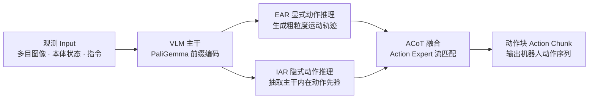

> 核验于源码基线 commit cb9d195 · 本页为 DeepWiki 风格深潜文档，所有代码引用均可溯源。

# 总览 Overview

**ACoT-VLA**（Action Chain-of-Thought for Vision-Language-Action Models）是官方开源的 VLA 策略新范式与参考实现：它不再让模型先在语言或图像里"想任务"，而是把链式推理直接搬进**动作空间**，让机器人以动作的语言进行斟酌与规划。本仓库同时是 **AgiBot World Challenge @ ICRA 2026（Reasoning to Action 赛道）** 的官方 baseline，内置 LIBERO、LIBERO-Plus、VLABench 三大仿真基准的完整训练与评测链路。



## 项目定位与动机

现有 VLA 大多依赖间接推理——预测子任务文本（语言层）或合成目标图像（视觉层），这类高层线索缺乏精确执行所需的细粒度信息。语义（任务意图）与运动学（关节与末端轨迹）之间存在一道**语义-运动学鸿沟**（semantic-kinematic gap）。ACoT-VLA 的主张是：最有效的推理应当**直接在动作空间中推演**，即让机器人"在动作语言中思考"（think in the language of actions）——以动作意图作为思维链的中间节点，从而减少"观测→动作"映射中的歧义，为 grounded 的长程策略学习铺路。

## 三大核心组件

- **EAR——显式动作推理器（Explicit Action Reasoner）**：一个轻量 Transformer，负责合成**粗粒度运动轨迹**，为精细动作提供直接的运动线索。
- **IAR——隐式动作推理器（Implicit Action Reasoner）**：通过交叉注意力建模，从 VLM 主干的**内部表征**中抽取隐式动作先验（latent action prior）。
- **ACoT——动作链式思考（Action Chain-of-Thought）**：EAR 与 IAR 协同构成 ACoT，把"斟酌过程"结构化为一连串动作意图，形成在动作空间中思考的完整推理范式。

三者共享 PaliGemma 主干与双动作专家（Coarse/Action Expert），EAR/IAR 可独立开合、IAR 侧另有多种隐式抽取器可选——这些开关全部集中在配置类 `src/openpi/models/acot_vla.py:267`（`ACOTConfig`）中，网络主体见 `src/openpi/models/acot_vla.py:376`（`ACOT_VLA`）。


*ACoT-VLA 总体框架：EAR 给出粗轨迹、IAR 给出动作先验，共同构成在动作空间中的链式思考（图来自论文框架图，逐模块细节见 [模型深潜](/model-acot)）。*

## 性能速览

ACoT-VLA 在多个仿真基准上达到 SOTA，并在分布偏移下表现出更强的鲁棒性。以下三张成绩表**逐格照抄**自仓库 README，未做任何取舍或四舍五入；其中 **"Frozen" 表示训练期间冻结 LLM 主干**（backbone 不参与更新），加粗为同列最优。

### LIBERO 基准

ACoT-VLA 在 LIBERO 全套上均有提升，尤其以 **LIBERO-Long** 差距最明显——长程任务中"观测→动作"的映射歧义被显著压缩。

| Method | Spatial | Object | Goal | Long | **Avg.** |
| --- | --- | --- | --- | --- | --- |
| $\pi_0$ | 96.8 | 98.8 | 95.8 | 85.2 | 94.1 |
| $\pi_{0.5}$ | 98.8 | 98.2 | 98.0 | 92.4 | 96.9 |
| **ACoT-VLA (Frozen)** | **99.4** | **99.6** | 98.8 | 96.0 | **98.5** |
| **ACoT-VLA** | 98.6 | 99.0 | **99.4** | **97.0** | **98.5** |

> *Note: Models are trained on the LIBERO dataset. "Frozen" indicates the LLM backbone is frozen during training. All metrics are average success rates (%). The best results are highlighted in **bold**.*

### LIBERO-Plus 鲁棒性评测

面对相机视角偏移、传感器噪声等扰动，ACoT-VLA 表现出显著鲁棒性优势（Zero-Shot 直接用 LIBERO 权重评测；SFT 表示在 LIBERO-Plus 训练集上微调；带 \* 者为官方 checkpoint 复现结果）。

| Setting | Method | Camera | Robot | Language | Light | Background | Noise | Layout | **Avg.** |
| --- | --- | --- | --- | --- | --- | --- | --- | --- | --- |
| **Zero-Shot** | $\pi_0^*$ | 61.0 | 40.8 | 63.5 | 89.3 | 84.1 | 80.1 | 76.4 | 69.4 |
| | $\pi_{0.5}^*$ | **75.8** | 79.4 | 83.3 | 95.5 | 95.0 | **89.6** | 87.0 | 85.7 |
| | **ACoT-VLA (Frozen)** | 68.9 | 80.3 | 84.1 | 95.6 | 93.1 | 81.5 | **88.3** | 83.6 |
| | **ACoT-VLA** | 72.6 | **82.6** | **87.5** | **97.7** | **96.5** | 87.8 | 88.1 | **86.6** |
| **SFT** | $\pi_0$ (Frozen) | 79.6 | 21.1 | 72.5 | 84.7 | 86.2 | 68.3 | 69.4 | 67.4 |
| | $\pi_{0.5}$ (Frozen) | 70.3 | 41.7 | **81.1** | **97.3** | 94.6 | 71.8 | 84.9 | 75.7 |
| | **ACoT-VLA (Frozen)** | 91.2 | 62.5 | 80.3 | 95.1 | 91.5 | 88.3 | 84.9 | 84.1 |
| | **ACoT-VLA** | **96.6** | **70.4** | 79.7 | 95.1 | **97.1** | **95.9** | **85.0** | **88.0** |

> *Note: Methods under **Zero-Shot** are trained on LIBERO and directly evaluated on LIBERO-Plus. **SFT** (Supervised Fine-Tuning) denotes models trained on the LIBERO-Plus training set. An asterisk (\*) denotes results reproduced using officially released checkpoints. "Frozen" indicates the LLM backbone is frozen during training. The best results are highlighted in **bold**.*

### VLABench

在未见过的纹理（unseen-texture）赛道与复杂桌面场景中，ACoT-VLA 同样带来显著增益，比较指标为 Intention Score（IS）与 Progress Score（PS）。

| Method | In-dist. (IS/PS) | Category (IS/PS) | Commonsense (IS/PS) | Instruction (IS/PS) | Texture (IS/PS) | **Avg. (IS/PS)** |
| --- | --- | --- | --- | --- | --- | --- |
| $\pi_0$ (Frozen) | 67.8 / 62.7 | 44.0 / 33.6 | 54.9 / **43.0** | **58.0** / 38.7 | 50.6 / 42.5 | 55.0 / 44.1 |
| $\pi_{0.5}$ (Frozen) | 75.0 / 60.8 | 49.6 / 35.3 | **57.5** / 41.6 | 57.1 / 30.3 | 62.0 / 47.4 | 60.2 / 43.1 |
| **ACoT-VLA (Frozen)** | **79.8 / 66.1** | **54.1 / 38.9** | 52.3 / 37.8 | 56.8 / **39.6** | **74.6 / 54.6** | **63.5 / 47.4** |

> *Note: "Frozen" indicates that the LLM backbone is frozen during training. The best results are highlighted in **bold**.*

## 里程碑与竞赛

本仓库即 **AgiBot World Challenge @ ICRA 2026 —— Reasoning to Action 赛道**的官方 baseline 实现，入口配置名为 `acot_icra_simulation_challenge_reasoning_to_action`，定义于 `src/openpi/training/config.py:1817`（该配置将 coarse/fine 双动作 horizon 均设为 30，并同时启用 EAR 与 IAR 以适配长程任务）。配置字段与调参入口见 [配置中心](/config-center)，训练与提交流程见 [评测与竞赛](/evaluation)。近期里程碑（来自 README News）：

- 🚀 [AgiBot World Challenge @ ICRA 2026](https://agibot-world.com/challenge2026)（Reasoning to Action 赛道）的[测试服务器](https://agibot-world.com/challenge2026/reasoning2action/quick-start)已开放。
- 🔥 该赛道的最小化训练代码已随本仓库发布。
- 🚀 该赛道的训练数据集（[AgiBotWorldChallenge-2026 · Reasoning2Action-Sim](https://huggingface.co/datasets/agibot-world/AgiBotWorldChallenge-2026/tree/main/Reasoning2Action-Sim)）已发布到 Hugging Face。

仓库 TODO 中 CALVIN、RoboCasa 的正式训练配置与模型 checkpoint 仍在排期，尚未随仓库发布。

## 与 OpenPI 的关系

ACoT-VLA 构建在开源 [OpenPI](https://github.com/Physical-Intelligence/openpi) 框架之上，沿用了其 `src/openpi`、`packages/openpi-client` 的工程布局，共享 PaliGemma/SigLIP 主干、LeRobot 数据格式、流匹配训练与策略服务器架构。在此基础上，本仓库**新增了 ACoT 系列模型与配套配置**：模型族位于 `src/openpi/models/acot_vla.py`，训练配置统一注册在 `src/openpi/training/config.py`（除 ICRA baseline 外，还含 LIBERO、LIBERO-Plus、VLABench 各实验配置）。继承了什么、改了什么，详见 [架构总览](/architecture)。

## 仓库一览

完整目录树以脚本自动生成快照存放于 [目录树快照](/generated/repo-tree)（autogenerated 页，勿手改），下表为模块级导览：

| 仓库区域 | 承载内容 | 相关页面 |
| --- | --- | --- |
| `src/openpi/models/acot_vla.py` | ACoT 模型族：ACOTConfig / ACOT_VLA（EAR、IAR、融合、冻结策略） | [模型深潜](/model-acot) |
| `src/openpi/training/config.py` | 全部训练配置注册表（含 ICRA baseline 与各基准实验） | [配置中心](/config-center) |
| `src/openpi/training`、`src/openpi/shared` | 数据转换、训练运行时与共享工具 | [训练系统](/training) |
| `examples/`（libero、droid、aloha_sim 等） | 各基准/真机的数据转换与示例 | [数据管线](/data) |
| `scripts/` | 训练、评测、策略服务器的入口脚本 | [训练系统](/training) · [推理与服务](/inference) |
| `packages/openpi-client` | 客户端 runtime、动作块订阅等 | [真机部署](/deploy-real) |
| `docs-site/` | 本文档站源码与自动生成快照 | [附录](/appendix) |

## 许可与引用

论文及相关资源遵循 [CC BY 4.0](https://creativecommons.org/licenses/by/4.0/)，代码遵循 [MIT](https://opensource.org/licenses/MIT)，并致谢 OpenPI 社区的贡献。引用格式（bibtex 原样复制自 README）：

```bibtex
@article{zhong2026acot,
  title={ACoT-VLA: Action Chain-of-Thought for Vision-Language-Action Models},
  author={Zhong, Linqing and Liu, Yi and Wei, Yifei and Xiong, Ziyu and Yao, Maoqing and Liu, Si and Ren, Guanghui},
  journal={arXiv preprint arXiv:2601.11404},
  year={2026}
}
```

## 相关页面

- [总览 Overview](/overview) —— 本页
- [快速上手 Quickstart](/quickstart) —— 安装、数据准备与一行命令跑通训练/推理
- [架构总览 Architecture](/architecture) —— 主干、双专家与数据流的一图流
- [数据管线 Data Pipeline](/data) —— LeRobot 格式与各数据集转换
- [模型深潜 Model (EAR/IAR)](/model-acot) —— ACoTConfig 字段、EAR/IAR/融合实现
- [训练系统 Training](/training) —— 训练运行时、冻结与 LoRA
- [配置中心 Config Center](/config-center) —— 全部配置注册表与逐项释义
- [推理与服务 Inference](/inference) —— 策略服务器与 rollout
- [评测与竞赛 Evaluation](/evaluation) —— LIBERO/VLABench/ICRA 评测入口
- [真机部署 Real-Robot](/deploy-real) —— 真机环境与部署
- [附录 Appendix](/appendix) —— 目录树快照、术语表与 FAQ
