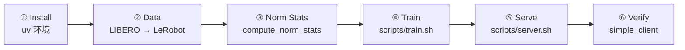

# 快速上手 Quickstart

> 核验于源码基线 commit cb9d195 · 命令均逐字取自仓库脚本/README。

读完本页，你就能在命令行把 ACoT-VLA 的最小闭环跑通：**安装环境 → 转换数据 → 计算归一化统计量 → 训练 → 启动策略服务 → 验证**。所有命令与参数都逐字取自仓库 `README.md` 与 `scripts/`、`examples/` 下的真实文件，关键处标注了出处与行号；机制层面的细节请转至文末相关页面。



## 0. 前置条件

| 项目 | 要求 | 出处 |
|---|---|---|
| 包管理 | `uv`（全流程用它管理 Python 环境） | README.md:98 |
| Python | ≥ 3.11 | pyproject.toml:6 |
| ⚠️ 硬件 | NVIDIA GPU 与 CUDA 环境（训练/推理均依赖） | `jax[cuda12]==0.5.3`，pyproject.toml:18 |
| 网络 / 磁盘 | 首次需下载 LIBERO 原始数据与预训练权重，体量以十 GB 计 | 见第 2、4 节提示 |
| Node.js 与 npm | 仅文档站（docs-site）本地预览/自检需要 | docs-site/docs/index.md:15-22 |

后续命令默认在仓库根目录（即 `ACoT-VLA/`）执行；⚠️ 标注的步骤必须使用 GPU，🌐 标注处会下载大数据。

## 1. 环境安装

以下命令块逐字取自 README「Installation」（README.md:100-107）：

```bash
git clone https://github.com/AgibotTech/ACoT-VLA.git
cd ACoT-VLA
git submodule update --init --recursive
GIT_LFS_SKIP_SMUDGE=1 uv sync
GIT_LFS_SKIP_SMUDGE=1 uv pip install -e .
```

各步作用：`submodule update` 递归拉取第三方依赖（LIBERO 示例依赖它，见 examples/libero/README.md:7-11）；`uv sync` 按 pyproject.toml 解析安装依赖（含 workspace 内的 openpi-client 与固定 rev 的 lerobot，pyproject.toml:65-71）；最后的 `uv pip install -e .` 把顶层 `openpi` 包以可编辑模式装入环境——两条 uv 命令都要跑，缺一不可（见常见坑 3）。

## 2. 准备数据集（以 LIBERO 为例）

仓库统一把数据转成 **LeRobot 格式**（README.md:111-116）。README 给出的最小写法是：

```bash
python examples/libero/convert_libero_data_to_lerobot.py
```

转换脚本的 docstring 提供了完整用法（examples/libero/convert_libero_data_to_lerobot.py:7-14）：

```bash
uv run examples/libero/convert_libero_data_to_lerobot.py --data_dir /path/to/your/data
uv run examples/libero/convert_libero_data_to_lerobot.py --data_dir /path/to/your/data --push_to_hub
```

脚本会把 4 个 LIBERO 子集（`libero_{10,goal,object,spatial}_no_noops`）合并输出为一个 LeRobot 数据集（examples/libero/convert_libero_data_to_lerobot.py:29-34）。🌐 网络/磁盘：`--data_dir` 指向已下载的原始 RLDS 数据（来自 HF 的 `openvla/modified_libero_rlds`，见 docstring 第 16 行），体量以十 GB 计；转换本身约需 30 分钟，产物写入 `$LEROBOT_HOME`（docstring 第 17-18 行）。另外需要先装 `uv pip install tensorflow tensorflow_datasets`（docstring 第 13-14 行）。

产物默认落在 `$LEROBOT_HOME/your_hf_username/libero/`——数据集名取脚本顶部的 `REPO_NAME = "your_hf_username/libero"` 常量（examples/libero/convert_libero_data_to_lerobot.py:28、39），也就是 `repo_id` 默认是占位符。**训练前必须把配置里的 `repo_id` 换成你的真实数据集**：本地路径（如 `$LEROBOT_HOME/.../libero`）或 `--push_to_hub` 之后对应的 HF repo_id；更全的数据说明见 /data。

## 3. 计算归一化统计量

训练前要为每个命名配置计算归一化统计量（README.md:124）：

```bash
uv run scripts/compute_norm_stats.py --config-name <CONFIG_NAME>
```

脚本打开该配置指向的数据集（`data.repo_id`），对 `state`、`actions`、`coarse_actions` 三个键按 10% 批次采样滚动统计（scripts/compute_norm_stats.py:102-106），最后把 `norm_stats.json` 写到**当前目录**（scripts/compute_norm_stats.py:131-133；src/openpi/shared/normalize.py:135-139）。这个 JSON 就是归一化“资产”：数据管线启动时从资产目录（默认 `./assets/<配置名>`，src/openpi/training/config.py:1177、1216-1218）按 asset_id（默认等于 repo_id，src/openpi/training/config.py:205）查找加载；配置加载层找不到时只打日志并返回 None（src/openpi/training/config.py:248-250），随后数据管线在 `transform_dataset` 处会**直接抛 ValueError**，提示先运行本脚本（src/openpi/training/data_loader.py:250-254，`fake` 数据集除外）——所以第 3 节不可跳过（见常见坑 7）。

`<CONFIG_NAME>` 必须是命名配置注册表里的合法名字（清单见 /config-center），LIBERO 常用 `pi0_libero` 或 `acot_libero_action_cot_explicit_implicit_co_fusion`。注意本脚本按 ACoT 数据键（含 `coarse_actions`）设计，对不产出该键的配置会整批跳过——选配置时留意模型类型。

## 4. 训练

一行命令即可开始训练（README.md:127）：

```bash
bash scripts/train.sh <CONFIG_NAME> <EXP_NAME>
```

train.sh 设好环境变量后执行 `uv run python scripts/train.py $CONFIG_NAME --exp-name=$EXP_NAME`（scripts/train.sh:1-9）。要点：

- `<EXP_NAME>` 是实验名，**必填**，并用于命名检查点目录（src/openpi/training/config.py:1155-1156、1221-1228）。
- 检查点按 `save_interval` 步写入 `./checkpoints/<CONFIG_NAME>/<EXP_NAME>/<step>`（src/openpi/training/config.py:1179、1226；ACoT-LIBERO 配置为每 10000 步一存，config.py:1605，`pi0_libero` 用默认 1000）。
- 指标：终端进度条每 `log_interval`(=100) 步打印一次（scripts/train.py:333-338）；wandb 默认开启（config.py:1203-1204）但 train.sh 预设了离线模式（scripts/train.sh:2），`wandb login` 后可改为在线查看曲线。

⚠️ 需要 NVIDIA GPU 与 CUDA：ACoT 配置默认 batch 较大（ACoT-LIBERO 为 128，src/openpi/training/config.py:1606-1607）。首次建议先跑 `pi0_libero`（完整微调 pi0，3 万步，config.py:1357）或低显存 LoRA 版 `pi0_libero_low_mem_finetune`（config.py:1359-1379）；想复现 ACoT 方法再用 acot_libero 系列。🌐 首次训练会加载预训练权重：pi0 系从 GCS `gs://openpi-assets/checkpoints/pi0_base/params` 拉取（config.py:1354），ACoT 系默认指向本机路径 `/mnt/public/zhonglinqing/pkgs/pi05_model/params`（config.py:1601-1603）——后者需替换为你持有的 pi05 权重文件。训练超参与调参见 /training。

## 5. 启动策略服务

训练出检查点后即可启动 WebSocket 策略服务（README.md:130）：

```bash
bash scripts/server.sh <GPU_ID> <PORT>
```

server.sh 把 `<GPU_ID>` 设为 `CUDA_VISIBLE_DEVICES`、调低 XLA 显存占用，随后执行 `uv run python scripts/serve_policy.py --env G2SIM --port <PORT>`（scripts/server.sh:4-12）——即该脚本**固定服务 ICRA 挑战赛的 G2SIM** 配置，默认从 `./checkpoints/acot_icra_simulation_challenge_reasoning_to_action/exp_name/30000` 加载模型（scripts/serve_policy.py:87-90）。

如果你训练的是 LIBERO，请直接调 serve_policy.py 显式指定环境与检查点（命令格式见 examples/libero/README.md:57-61、29-35）：

```bash
uv run scripts/serve_policy.py --env LIBERO
uv run scripts/serve_policy.py --env LIBERO policy:checkpoint \
  --policy.config acot_libero_action_cot_explicit_implicit_co_fusion \
  --policy.dir ./checkpoints/<CONFIG_NAME>/<EXP_NAME>/<step>
```

⚠️ 需要 NVIDIA GPU 与 CUDA。serve_policy 的默认 env 是 ALOHA_SIM（scripts/serve_policy.py:46），默认端口 8000（scripts/serve_policy.py:53），服务监听 0.0.0.0（scripts/serve_policy.py:129）；支持的环境（ALOHA/ALOHA_SIM/DROID/LIBERO/VLABENCH/LIBEROPLUS/G2SIM）见 scripts/serve_policy.py:14-23，更多参数可用 `--help` 查看。

## 6. 最小闭环验证

服务起来后，另开一个终端运行极简客户端（examples/simple_client/README.md:22-29）：

```bash
uv run examples/simple_client/main.py --env LIBERO
```

客户端会连接 `0.0.0.0:8000`（examples/simple_client/main.py:31-33），用随机观测连发 20 次推理（`num_steps`，examples/simple_client/main.py:37-41），并打印每次推理与 server/policy 的时延统计表（examples/simple_client/main.py:136-147）。⚠️ 推理在 GPU 上进行；观测是随机的（LIBERO 随机观测里 prompt 固定为 "do something"，examples/simple_client/main.py:176-182），所以这一步只验证「客户端 ↔ 服务连通 + 推理吞吐」，不代表任务成功率——真实 LIBERO 仿真评测（examples/libero/main.py）见 /evaluation。若你训练的是 ICRA G2SIM 配置，也可直接 `uv run scripts/openloop.py` 对比真值/预测动作并出对比图（脚本内硬编码了该配置与检查点路径，scripts/openloop.py:15-16、87，需对应训练产物存在）。

## 7. Docker 快捷方式

仓库内各 example 均提供 Docker 运行方式，总述见仓库 `docs/docker.md`。Docker 需以 rootless 模式安装并配好 NVIDIA container toolkit（docs/docker.md:6-9）；随后一条命令即可起整条链路，例如 LIBERO：`docker compose -f examples/libero/compose.yml up --build`（examples/libero/README.md:20-21；Ubuntu 22.04 可用 `scripts/docker/install_docker_ubuntu22.sh` 等脚本一键装好，docs/docker.md:12）。首次构建镜像较久，之后有缓存会快很多。评测与真机部署各自的容器用法见 /evaluation。

## 常见坑

1. **repo_id 常是作者本机路径**：ACoT 系配置默认 repo_id 形如 `/mnt/public/zhonglinqing/...`（LIBERO 见 config.py:1588，LIBERO-Plus 见 config.py:1653），换机器必须改成你自己的数据集路径或 HF repo；`pi0_libero` 默认则是 HF 的 `physical-intelligence/libero`（config.py:1343），需要能访问 Hugging Face。
2. **子模块未拉取**：跳过 `git submodule update --init --recursive` 会让依赖 LIBERO 的代码直接 import 失败（examples/libero/README.md:7-11）。
3. **uv sync 后仍需 `uv pip install -e .`**：两条命令都来自 README（README.md:104-105），只跑第一条时顶层 `openpi` 包未装入，`import openpi` 会报错。
4. **GIT_LFS_SKIP_SMUDGE=1 不要删**：README 在两条 uv 命令前都加了该前缀（README.md:104-105），照抄即可，避免依赖解析时触发 git-lfs 下载。
5. **显存不够**：JAX 会预分配大比例显存（train.sh 设 0.85，scripts/train.sh:3；server.sh 设 0.9 且 `allocator=platform`，scripts/server.sh:6-8）。想冒烟测试可直接 `DEBUG_MODE=true uv run python scripts/train.py <CONFIG_NAME> --exp-name=smoke`（绕开 train.sh:1 的强制 `DEBUG_MODE=false`）——以 ACoT-LIBERO 配置为例会退化为 batch=1、缩短保存间隔（config.py:1605-1608），检查点落到 `.../debug` 目录（config.py:1225-1228）；也可换 low_mem/LoRA 配置。
6. **wandb 登录是可选的**：日志默认开启（config.py:1203-1204）但 train.sh 预设 `WANDB_MODE=offline`（scripts/train.sh:2），不登录也能本地记录；要在线看曲线先 `wandb login` 再改为 online。
7. **忘了算归一化统计量**：config 加载层缺失时只打日志并返回 None（config.py:248-250），随后 `transform_dataset` 会直接抛 ValueError 并提示先运行 `scripts/compute_norm_stats.py --config-name=<配置名>`（data_loader.py:250-254；`fake` 数据集除外）——训练前先完成第 3 节，并确认 `norm_stats.json` 位置与配置的资产目录对应。
8. **server.sh 固定 G2SIM**：脚本内部写死 `--env G2SIM`（scripts/server.sh:12），想用它直接服务自己训的 LIBERO 模型不会成功；改用第 5 节的 serve_policy.py 显式指定 env / checkpoint。

## 相关页面

- 项目定位与性能：[总览 /overview](/overview)
- 数据格式与更多数据集：[数据管线 /data](/data)
- 训练细节与调参：[训练系统 /training](/training)
- 命名配置注册表：[配置中心 /config-center](/config-center)
- 服务与推理参数：[推理与服务 /inference](/inference)
- 仿真评测与竞赛闭环：[评测与竞赛 /evaluation](/evaluation)
