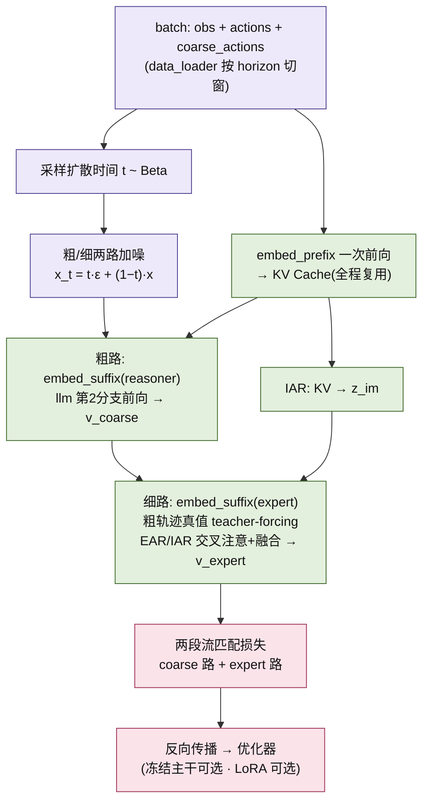
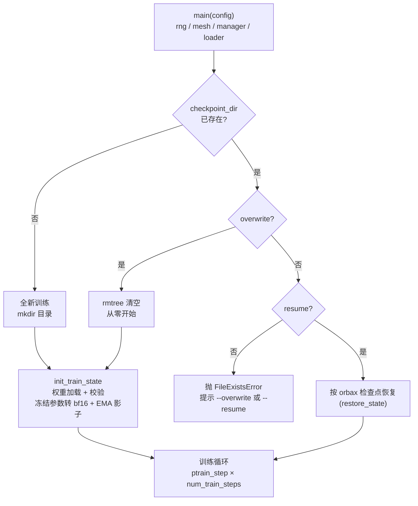

# 训练系统 Training

> 核验于源码基线 commit cb9d195。

本页讲 ACoT-VLA 的**训练系统**：从一条启动命令到落地检查点的全链路。入口脚本 `scripts/train.py:250` 只做编排——建 mesh、起数据装载、初始化或恢复训练状态、循环执行 jitted 训练步；真正的机制散落在 `src/openpi/training/`：两步前向与两段流匹配损失（`src/openpi/models/acot_vla.py:695`）、优化器与学习率调度、FSDP 分片、orbax 检查点，以及把 pi0 预训练权重合并进 ACoT 的加载器。读者是**要跑训练、调超参或改训练代码的人**；前置条件：数据已按 [数据管线](/data) 转成 LeRobot 格式并算好归一化统计（见 [快速上手](/quickstart)）。模型内部结构（EAR/IAR/主干）见 [模型深潜](/model-acot)，字段逐项释义见 [配置中心](/config-center)。



*图：一次 ACoT 训练步"数据 → 加噪 → prefix 前向 → 粗/细两路 → 两段损失"的流程，与 `compute_loss`（`src/openpi/models/acot_vla.py:695`）逐段对应。*

## 1. 启动入口

仓库不用手写 YAML：一切训练配置注册在命名配置表 `_CONFIGS`（`src/openpi/training/config.py:1241` 起；25 个命名配置的导出表见 [config-registry](/generated/config-registry)）。命令行由 tyro 生成——第一个位置参数是**配置名**，其余是 `--字段=值` 覆盖（`src/openpi/training/config.py:1947`）。仓库给出的真实命令（`scripts/train.sh:9`，README「Training & Inference」一节）：

```bash
# 1) 先为数据集计算归一化统计（assets，每个数据集一次）
uv run scripts/compute_norm_stats.py --config-name acot_libero_action_cot_explicit_implicit_co_fusion

# 2) 训练：位置参数 = 配置名，第二个参数 = 实验名
bash scripts/train.sh acot_libero_action_cot_explicit_implicit_co_fusion my_run_001
# 上一条等价于 train.sh 内部执行的：
# /root/.local/bin/uv run python scripts/train.py acot_libero_action_cot_explicit_implicit_co_fusion --exp-name=my_run_001
```

要点：

- **`--exp-name` 必填**：检查点目录 = `<checkpoint_base_dir>/<config.name>/<exp_name>`，缺了 `exp_name` 直接抛 `ValueError`（`src/openpi/training/config.py:1221`；默认基目录 `./checkpoints`，`src/openpi/training/config.py:1179`）。
- `scripts/train.sh:1` 统一设置环境：`DEBUG_MODE=false`、`WANDB_MODE=offline`、`XLA_PYTHON_CLIENT_MEM_FRACTION=0.85`。
- wandb 默认开启（`src/openpi/training/config.py:1204`）；`init_wandb`（`scripts/train.py:50`）把运行名设为 `exp_name`，run id 落盘到 checkpoint 目录的 `wandb_id.txt`（`scripts/train.py:59`）供断点续训复用；想完全关掉传 `--wandb-enabled=false`。
- 日志格式统一在 `init_logging`（`scripts/train.py:31`）：时间 + 级别 + `(进程:文件:行号)`，直接打到 stdout / tqdm，无独立日志文件。

## 2. 训练状态与初始化

主流程（`scripts/train.py:250`）：先校验 `batch_size` 能被设备数整除（`scripts/train.py:254`），再按 seed 拆 rng（`scripts/train.py:261`）、建 mesh（`scripts/train.py:264`）、初始化 checkpoint manager（`scripts/train.py:268`）、起 wandb 与数据装载（`scripts/train.py:274`、`276`），最后 `init_train_state` 进入循环。启动期的分支语义：



`TrainState`（`src/openpi/training/utils.py:15`）是 Flax NNX 结构：`step`、`params`（nnx.State）、`model_def`（GraphDef，每步重放前向用）、`opt_state`、`tx`，以及可选的 `ema_decay` / `ema_params`。`init_train_state`（`scripts/train.py:85`）按序做四件事：

1. **建优化器与模型**：`create_optimizer`（`scripts/train.py:88`）后 `config.model.create(rng)` 随机初始化（`scripts/train.py:93`）。
2. **注入预训练权重**（仅非 resume）：加载器先按目标参数结构做形状/类型校验（`scripts/train.py:73`），再把加载到的子集合并进模型后 jit 初始化（`scripts/train.py:90`、`122`），详见 §7。
3. **冻结处理**：`freeze_filter` 命中的参数先转 bfloat16（`scripts/train.py:102`）；优化器状态只对 `trainable_filter`（= 全部 Param 减去 `freeze_filter`，`src/openpi/training/config.py:1231`）创建（`scripts/train.py:111`）。
4. **EMA**：`ema_decay` 非空时克隆一份参数作影子（`scripts/train.py:112`），每步按 `decay·旧 + (1−decay)·新` 就地更新（`scripts/train.py:169`）。

resume / overwrite 语义：二者在配置层互斥（§9 坑 1）；overwrite 会先 `rmtree` 整个目录（`src/openpi/training/checkpoints.py:26`）；resume 时 `init_train_state` 只返回 `eval_shape` 与分片规格，真正的状态来自 `restore_state`（`scripts/train.py:119` → `scripts/train.py:298`）。另注意 `DEBUG_MODE=true` 会把目录改到 `<name>/debug` 并**强制 overwrite**（`src/openpi/training/config.py:1225`、`scripts/train.py:271`），适合冒烟。

## 3. 训练步：train_step 与 acot_train_step

两者骨架几乎同构，差别只在输入与损失签名：

- `train_step`（`scripts/train.py:137`）供 pi0 等非 ACoT 模型：batch = `(obs, actions)`，调 `compute_loss(rng, observation, actions, train=True)`（`scripts/train.py:150`）。
- `acot_train_step`（`scripts/train.py:194`）供 ACoT 模型：batch 是 `(obs, actions, coarse_actions)` 三元组——ACoT 数据装载器按此解包（`src/openpi/training/data_loader.py:599`），损失多收 `coarse_actions`（`scripts/train.py:204`）。

选哪个步函数由 `model_type ∈ {ACOT_VLA_PI0, ACOT_VLA_PI05}` 决定（`scripts/train.py:301`），选定后整体 `jax.jit` 并 donate 训练状态（`scripts/train.py:302`）。

损失在 `compute_loss`（`src/openpi/models/acot_vla.py:695`）内展开：先采样扩散时间 `t ~ Beta(1.5, 1)` 并缩放到非退化区间（`src/openpi/models/acot_vla.py:711`）；粗/细两路各采同形状高斯噪声（`src/openpi/models/acot_vla.py:708`）构造插值目标；随后 `embed_prefix` 做一次 prefix 前向得到 KV Cache（`src/openpi/models/acot_vla.py:722`），reasoner（粗）与 expert（细）的两次 suffix 前向分别把 prefix token 与 `suf_type="reasoner" / "expert"` 的 token 拼接后送入（`embed_suffix`，`src/openpi/models/acot_vla.py:551`）。EAR 开启时，细路把**真值 `coarse_actions` 作 teacher-forcing** 的显式推理输入（`src/openpi/models/acot_vla.py:743`），IAR 则直接从前缀 KV Cache 抽取隐式推理（`src/openpi/models/acot_vla.py:749`）。损失是**两路速度场回归目标之和**——见代码变量：预测 `v_ref_t`（粗路，`src/openpi/models/acot_vla.py:781`）与 `v_expert_t`（细路，`src/openpi/models/acot_vla.py:782`），回归目标 `u_ref_t` / `u_expert_t`（`src/openpi/models/acot_vla.py:715`），两路对预测与目标差值的平方取均值后相加（`src/openpi/models/acot_vla.py:784`）；EAR 关闭时只剩细路单项（`src/openpi/models/acot_vla.py:789`）。

梯度与参数更新在同一段内完成：`nnx.DiffState(0, trainable_filter)` 让 `value_and_grad` 只对可训练子集求导（`scripts/train.py:157`）；`tx.update` + `optax.apply_updates`（`scripts/train.py:161`）后 `nnx.update` 写回模型、`step + 1`（`scripts/train.py:165`），并就地更新 EMA（`scripts/train.py:169`）。每步返回 `loss / grad_norm / param_norm`（`scripts/train.py:186`；`param_norm` 只统计非 bias/scale 的 ndim>1 核参数，`scripts/train.py:177`）；主循环每 `log_interval` 步对窗口取均值写日志与 wandb（`scripts/train.py:333`）。

## 4. 优化器与学习率调度

`TrainConfig` 默认 `optimizer=AdamW`、`lr_schedule=CosineDecaySchedule`（`src/openpi/training/config.py:1166`）。实现与默认值见下表（全部在 `src/openpi/training/optimizer.py`）：

| 组件 | 默认值 | 锚点 |
| --- | --- | --- |
| CosineDecaySchedule | warmup 1_000 步，峰值 2.5e-5，衰减 30_000 步至 2.5e-6 | `src/openpi/training/optimizer.py:16` |
| RsqrtDecaySchedule | warmup 1_000 步，峰值 5e-5，timescale 10_000 | `src/openpi/training/optimizer.py:35` |
| AdamW | b1=0.9, b2=0.95, eps=1e-8, weight_decay=1e-10, clip_gradient_norm=1.0 | `src/openpi/training/optimizer.py:66` |
| SGD | lr=5e-5, momentum=0.9（不支持 weight decay） | `src/openpi/training/optimizer.py:88` |

两点提醒：`create_optimizer` 调用时 `weight_decay_mask=None`（`scripts/train.py:88`），配合默认 1e-10 的 `weight_decay`，实际几乎不产生衰减；AdamW 的 `create` 返回 `optax.chain(全局梯度裁剪, adamw)`（`src/openpi/training/optimizer.py:84`）。命名配置会覆盖默认——例如 LIBERO 的 ACoT 配置把调度换成 warmup 10_000、峰值 5e-5、decay 1e6 的余弦，EMA 提到 0.999（`src/openpi/training/config.py:1593`、`1600`）。

## 5. 分布式与 FSDP 分片

mesh 由 `make_mesh` 构造（`src/openpi/training/sharding.py:17`）：形状 `(总设备数 // fsdp_devices, fsdp_devices)`，两轴分别命名 `batch` 与 `fsdp`（`src/openpi/training/sharding.py:7`）。要点：

- **数据沿两轴同时分片**：`DATA_AXIS = (batch, fsdp)`（`src/openpi/training/sharding.py:9`），因此 `batch_size` 必须能被 `jax.device_count()` 整除（`scripts/train.py:254`），每进程本地 batch 是 `batch_size // jax.process_count()`（`src/openpi/training/data_loader.py:374`）。
- **参数 FSDP 分片**：`fsdp_sharding` 只对至少 2 维、体积 ≥ 4 MiB 的数组沿可整除的最大轴切到 `fsdp` 轴（`src/openpi/training/sharding.py:48`）；标量/小数组复制；`fsdp_devices=1` 时全部复制，退化为纯数据并行（`src/openpi/training/sharding.py:71`）。
- 循环里每个 `ptrain_step` 调用包在 `set_mesh(mesh)` 上下文中（`scripts/train.py:330`），让模型内部的 `activation_sharding_constraint` 能拿到全局 mesh（`src/openpi/training/sharding.py:26`、`40`）。jit 的输入分片：rng 复制、训练状态按 FSDP 规格、batch 沿数据轴（`scripts/train.py:304`）。

`fsdp_devices` 默认 1（`src/openpi/training/config.py:1213`）；官方注释的直觉是：4 卡、`fsdp_devices=2` 时，模型参数分到 2 张卡、两组设备间做数据并行（`src/openpi/training/config.py:1209`）。想更省显存就调大它，代价是通信变多、可能更慢。

## 6. 检查点与资产

checkpoint manager 注册三个 item（`src/openpi/training/checkpoints.py:40`）：`assets`（回调处理器）、`train_state` 与 `params`（orbax PyTree）。`save_state`（`src/openpi/training/checkpoints.py:65`）在 `<step>/assets` 下另存归一化统计（`src/openpi/training/checkpoints.py:71`），并用 `_split_params` 把"推理用权重"单独拆进 `params` item——**有 EMA 就存 EMA**（`src/openpi/training/checkpoints.py:154`），落盘结构即 `<ckpt>/<step>/{assets, train_state, params}`。策略服务器/推理侧加载的正是 `<step>/params`（路径约定注释见 `src/openpi/training/weight_loaders.py:38`）。

保存节奏：每 `save_interval`（默认 1000 步）以及最后一步（`scripts/train.py:342`）；`keep_period`（默认 5000，`src/openpi/training/config.py:1196`）连同 `max_to_keep=None` 交给 orbax 决定旧检查点回收（`src/openpi/training/checkpoints.py:47`）；写盘异步（timeout 7 200 s，`src/openpi/training/checkpoints.py:51`），脚本末尾 `wait_until_finished()` 等落盘完成（`scripts/train.py:346`）。恢复走 `restore_state`：读回 `train_state` 与 `params` 两个 item 后合并（`src/openpi/training/checkpoints.py:95`）。

## 7. 预训练权重加载与合并

`TrainConfig.weight_loader`（默认 `NoOpWeightLoader`，`src/openpi/training/config.py:1164`）在模型初始化后加载（可能部分的）权重。实现都在 `src/openpi/training/weight_loaders.py`：

| 加载器 | 作用 | 锚点 |
| --- | --- | --- |
| `NoOpWeightLoader` | 从零随机初始化 | `src/openpi/training/weight_loaders.py:31` |
| `CheckpointWeightLoader` | 整份权重（含 LoRA 补键），如 `gs://openpi-assets/.../params` | `src/openpi/training/weight_loaders.py:37` |
| `ACOTCheckpointWeightLoader` | **pi0/pi0.5 预训练 → ACoT**：键重映射 + 缺失参数补全 | `src/openpi/training/weight_loaders.py:56` |
| `PaliGemmaWeightLoader` | 官方 PaliGemma `pt_224.npz`，同名覆盖、其余保留 | `src/openpi/training/weight_loaders.py:83` |

`ACOTCheckpointWeightLoader` 是 ACoT 训练的关键：从 pi0.5 checkpoint 载入后，先把 pi0 的动作投影/时间 MLP 键**重映射到粗路（reasoner）键**（`src/openpi/training/weight_loaders.py:62`，注释：用预训练权重初始化 coarse & explicit action reasoner 以稳定训练，`src/openpi/training/weight_loaders.py:74`），再对全部缺失键走 `_merge_params`（`src/openpi/training/weight_loaders.py:81`）。合并规则：形状兼容直接覆盖（`_align_param`，`src/openpi/training/weight_loaders.py:102`）；形状不同按最小公共形状截断、空缺补 zeros 或 random（`src/openpi/training/weight_loaders.py:106`）；完全缺失的键先尝试从 `*_N` → `*_1` 的兄弟参数克隆，否则按 `random·0.02` 或 zeros 初始化（`src/openpi/training/weight_loaders.py:138`）。加载结果合并进模型前做形状/类型全量校验（`scripts/train.py:73`）。

⚠️ 命名配置里的路径是作者本机路径（如 `/mnt/public/zhonglinqing/pkgs/pi05_model/params`，`src/openpi/training/config.py:1601`），跑前务必替换成你自己的 pi05/pi0 checkpoint 路径。

## 8. 冻结主干与 LoRA 实操

冻结的接线很直接：`freeze_filter`（默认 `nnx.Nothing`，`src/openpi/training/config.py:1171`）→ `trainable_filter = All(Param, Not(freeze_filter))`（`src/openpi/training/config.py:1231`）→ 优化器状态只对可训练子集创建（`scripts/train.py:111`）、每步 `DiffState` 求导也只对可训练子集（`scripts/train.py:157`）、冻结参数在初始化时转 bfloat16（`scripts/train.py:102`）。

ACoT 配置统一用 `ACOTConfig.get_freeze_filter(...)` 生成过滤器（`src/openpi/models/acot_vla.py:333`）：主干用 `.*llm.*` 系 PathRegex，并以负向前瞻排除 `_1`（粗动作专家）与 `_2`（动作专家）两路（`src/openpi/models/acot_vla.py:334`）；可分别控制 `freeze_vision` / `freeze_llm` / `freeze_llm_embedder` / `freeze_dual_ae`。**LoRA 的关键在 `src/openpi/models/acot_vla.py:360`**：只要 variant 字符串含 `"lora"`，`.*lora.*` 就被从冻结集剔除（`src/openpi/models/acot_vla.py:370`），于是"主干冻结 + LoRA 可训练"同时成立。

现成例子：ICRA 挑战赛 baseline `acot_icra_simulation_challenge_reasoning_to_action`（`src/openpi/training/config.py:1816`）把主干换成 `paligemma_variant="gemma_2b_lora"`（`src/openpi/training/config.py:1821`），再 `freeze_llm=True`（`src/openpi/training/config.py:1936`）→ 主干冻结、LoRA 与两个动作专家可训练；LIBERO/VLABench/LIBERO-Plus/go1 的 ACoT 配置则是 `freeze_llm=True` 的"主干冻结、双专家微调"（`src/openpi/training/config.py:1608` 等）。非 ACoT 的 pi0 低显存 LoRA 范式见 `pi0_libero_low_mem_finetune`：双专家全换 LoRA 变体、`get_freeze_filter()` 一键冻结并关闭 EMA（`src/openpi/training/config.py:1359`）。

## 9. 常见坑

1. **`--resume` 与 `--overwrite` 互斥**：同时给会直接 `ValueError: Cannot resume and overwrite at the same time`（`src/openpi/training/config.py:1236`）。目录已存在但两者都不给，则 `FileExistsError` 并提示补参数（`src/openpi/training/checkpoints.py:30`）——中断后续训要显式 `--resume`。
2. **batch / 设备数整除约束**：`batch_size` 必须能被设备数整除（`scripts/train.py:254`），且总设备数必须能被 `fsdp_devices` 整除（`src/openpi/training/sharding.py:18`），否则启动即报错。`fsdp_devices=1` 纯数据并行最稳；显存不够再按 §5 放大 fsdp 轴。
3. **`num_workers` 不是越大越好**：默认 2（`src/openpi/training/config.py:1187`）；torch worker 越多装载越快但吃内存/CPU（`src/openpi/training/data_loader.py:372`）；官方 ACoT 配置用 24–48（`src/openpi/training/config.py:1933`），小机器先调低。
4. **wandb 离线与恢复**：`train.sh` 默认 `WANDB_MODE=offline`（`scripts/train.sh:2`）；resume 时 `init_wandb` 用 `wandb_id.txt` 里的 run id、`resume="must"`（`scripts/train.py:58`）——换机器或清缓存后 id 匹配不上会失败；不要日志就 `--wandb-enabled=false`（`src/openpi/training/config.py:1204`）。
5. **漏算 norm stats 起不来**：真实数据（非 fake）加载时 `norm_stats` 为空直接抛错，提示先跑 `compute_norm_stats.py`（`src/openpi/training/data_loader.py:249`）——README 也把算 stats 放在训练前。
6. **首次冒烟**：`TrainConfig` 默认 `data=FakeDataConfig`（`src/openpi/training/config.py:1174`），`repo_id="fake"` 走内置 `FakeDataset`（1024 样本、按 `inputs_spec` 均匀随机，`src/openpi/training/data_loader.py:135`），可打通"初始化 → 前向 → 反向 → 存盘点"；但 `FakeDataset` 只产出 obs/actions（`src/openpi/training/data_loader.py:157`），而 ACoT 数据包装器按 `obs/actions/coarse_actions` 三元组解包（`src/openpi/training/data_loader.py:607`）——ACoT 配置纯 fake 会缺 `coarse_actions`，更稳的冒烟是 `DEBUG_MODE=true` + 一小段真实数据（目录自动落到 `<name>/debug` 且强制 overwrite，`src/openpi/training/config.py:1225`）。

## 相关页面

- [总览 Overview](/overview) —— 项目定位、三大组件与性能速览
- [快速上手 Quickstart](/quickstart) —— 安装、数据准备与一条命令跑通训练
- [架构总览 Architecture](/architecture) —— 五层结构与训练/推理的解耦
- [数据管线 Data Pipeline](/data) —— LeRobot 格式、转换脚本与 norm stats
- [模型深潜 Model (EAR/IAR)](/model-acot) —— ACOTConfig 字段与两段前向的模型侧实现
- [配置中心 Config Center](/config-center) —— 命名配置注册表、TrainConfig 字段速查
- [推理与服务 Inference](/inference) —— 训练产出 checkpoint 的加载与 rollout
- [评测与竞赛 Evaluation](/evaluation) —— 用训练好的 checkpoint 跑 LIBERO/VLABench/ICRA
- [真机部署 Real-Robot](/deploy-real) —— 真机数据采集与闭环部署
- [附录 Appendix](/appendix) —— 目录树快照、术语表与 FAQ
